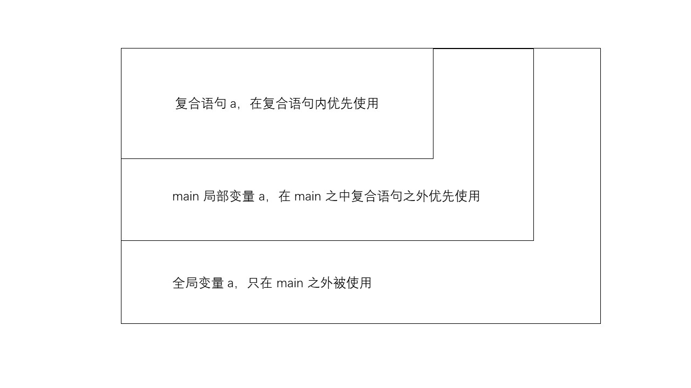

# 变量的作用域和生命周期

## 作用域

变量的作用域指示了变量可以被使用的范围。例如，定义在函数外的全局变量其作用域是全局的，也就是说其可以在程序的各个位置使用。定义在函数内的局部变量则只能在函数内部使用。注意，这里的使用指的是通过变量的名字来获取或修改其值。

在[复合语句](../basic/Statements)中声明的变量的作用域从其声明点开始，直到复合语句结束。

``` cpp
{
    int i = 0;
}
int j = i; // 报错，i 的作用域已经结束了
```

函数参数的作用域就是整个函数体。因此你无法在函数之外使用函数参数。

## 冲突的名字

如果你在不同作用域上声明了相同名字的变量，则作用域小的变量最优先被使用。

``` cpp
int a = 0;  // 全局变量，作用域为整个程序

void fun()
{
    cout << a << endl;      // 在 fun 内处于有效作用域的 a 只有全局变量的那一个，输出 0。
}

int main()
{
    int a = 1;              // 局部变量，作用域仅在 main 函数中。
    {
        int a = 2;          // 复合语句中的局部变量，作用域为复合语句的范围内。
        cout << a << endl;  // 复合语句中的 a 作用域最小，输出 2。
    }
    cout << a << endl;      // 复合语句内的 a 的作用域结束，此时 main 中的 a 作用域最小，输出 1。
    fun();
}

```

**输出：**

```
2
1
0
```



由于作用域，在 for 循环或者是 while 循环内声明或是定义的变量是不能在其外部使用的。想要在循环结束后保留循环内使用的变量，你就必须在进入循环之前就声明变量。

虽然作用域允许你使用冲突的名字，但是在实际编写代码时还是应当避免发生名字冲突，以免混淆。例如，在写多重循环时，你就需要注意使用不同的循环变量如 `i1`，`i2`，`i3` 等。

## 生命周期

生命周期指的是变量在内存上能够存活的时间范围。一般变量的生命周期和其作用域是一致的，在变量的作用域结束之后，变量的生命也就结束了，此时，分配给变量的内存会被回收掉，变量即被销毁了。如果你在这个时候通过一些其他的方式如指针来调用那个变量，将会出现不可预知的事情。

``` cpp
int *fun()
{
    int a = 10;     // a 是函数的局部变量，函数调用结束后，a 就被销毁了，在函数外通过指针调用 a 是一个危险的行为！
    return &a;
}

int main()
{
    int *p = fun();
    cout << *p;
}
```

执行上面的程序将会发生运行时错误。

有时，你会希望变量能活得久一点，好让我们能够在程序的不同部分进行通信和交流。最简单的方法就是使用全局变量。全局变量的生命周期从程序开始直到程序结束，你可以在程序执行的任意时刻放心地使用全局变量。另外一种方法是使用动态分配内存。动态分配的内存存储在堆上，其生命周期从分配开始直到程序结束，或是主动释放内存。

``` cpp
char *toLower(char *str)
{
    int length = strlen(str);   // 定义在 string.h 中，用来获取字符串的长度。
    char *ans = (char*)malloc(strlen(str) + 1); // 动态分配的内存，即使离开了函数也不会被回收或者销毁，除非主动释放。
    for (int i = 0; i < length; ++i)
    {
        char ch = str[i];
        if (ch >= 'A' && ch <= 'Z')
            ch += 'a' - 'A';
        ans[i] = ch;
    }
    ans[length] = '\0';         // 在末尾补上空字符，使其成为 C 标准的字符串。
    return ans;
}

int main()
{
    printf("%s" , toLower("Welcome To The Internet!"));
}
```

**输出：**

```
welcome to the internet!
```