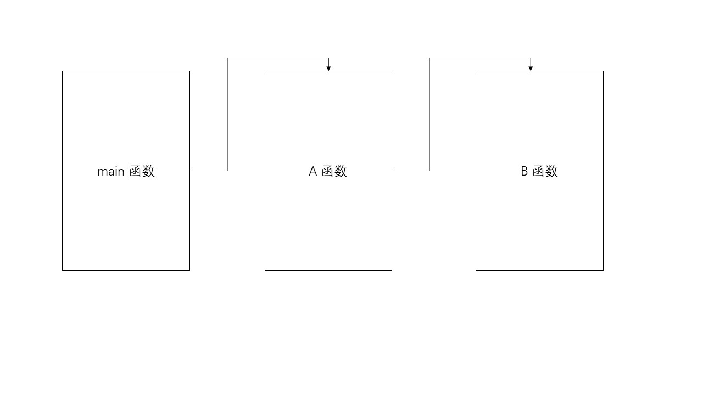
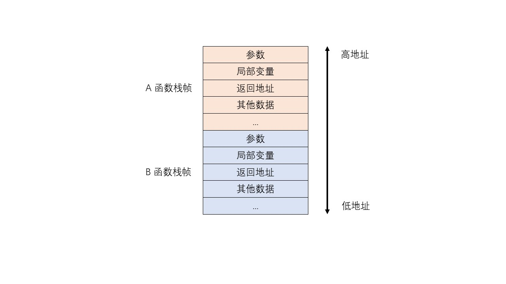
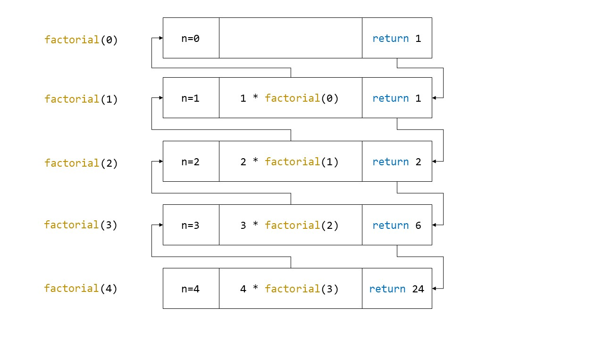

# 函数

数学中，函数是从数到数的映射，即给定一个自变量，函数就会输出一个因变量。而在计算机中，函数的定义稍微有些不同。计算机中的函数是用来执行一些特定功能的东西。函数可以返回一些特定的值，也可以完全没有返回值（返回的类型为 `void`）；函数可以接受一个或多个参数，也可以完全不接受任何参数（参数为空）。

## 函数的定义

函数由其参数的类型和返回值的类型划分为不同的类型。函数的类型由函数的定义决定。以下是函数一般定义：

``` cpp
T nameOfFunction(T1 arg1, T2 arg2, ...)
```

其中，`T` 为函数返回值的类型，`T1`，`T2` 分别为参数的类型，`arg1`，`arg2` 为对应的参数。`nameOfFunction` 为函数的名字。

以下是一些函数定义的例子：

``` cpp
double sqrt(double x)                   // 平方根函数，输入一个 double，返回一个 double
void clear()                            // 返回类型和参数都为空
int recursive(int n)                    // 一个参数为 int，返回也为 int
string connect(string s1, string s2)    // 两个 string 参数，返回一个 string
```

注意，函数的参数是有顺序的，不要颠倒了！

函数的定义后面要紧跟着一个花括号，花括号内为函数的具体实现，这个东西称为函数体。函数体决定了函数的具体功能和作用。

``` cpp
int max(int a, int b)
{
    // 花括号内可以像 main 中一样编写语句，用来实现相应的功能。
    if (a > b)
        return a;
    else
        return b;
}
```

在编写代码时，我们写的 `main` 实际上也是一种函数，`main` 就是我们程序的入口位置，程序开始运行时，将会从 `main` 函数开始执行代码。因此，你不能把函数定义在其他函数或是 `main` 函数中。因此，完整的代码应该是下面的样子：

``` cpp
#include <iostream>

int max(int a, int b)
{
    // 花括号内可以像 main 中一样编写语句，用来实现相应的功能。
    if (a > b)
        return a;
    else
        return b;
}

int main()
{
    // 省略...
}
```

## 函数的返回值

在上面的 `max` 函数中，你应该注意到了一个特殊的语句 `return`。`return` 用来指示我们函数的返回值，你可以直接返回一个变量，也可以返回一个字面量，甚至可以返回一个表达式，只要它们的类型与我们的函数的返回类型匹配即可。

``` cpp
int max(int a, int b)
{
    string str = "Huh?";
    return str; // 报错，返回的类型与函数的返回类型不匹配！
}
```

在执行 `return` 语句后，函数将会直接退出，后面的代码将不会再执行。

``` cpp
int max(int a, int b)
{
    if (a > b)
    {
        cout << "a is max.\n";
        return a;
        cout << "The value is " << a << ".\n";
    }
    else
    {
        cout << "b is max.\n";
        return b;
        cout << "The value is " << b << ".\n";
    }
}
```

**输入：**

```
2 3
```

**输出：**

```
b is max.
```

如果函数的返回类型为 `void`，则 `return` 语句后面不需要跟着任何值。`return` 后，函数直接退出。函数中的语句全部执行完毕后函数也会自动退出，此时，`return` 可以省略不写。

``` cpp
int a[100];
void clear()
{
    for (int i = 0; i < 100; ++i)
        a[i] = 0;
    return;     // 此处的 return 可以省略
}
```

但是，如果函数的返回类型不是 `void`，则一定要注意，函数的所有分支都要有相应的 `return`，否则可能会出现运行时错误！

下面就是一个错误的例子：

``` cpp
int max(int a, int b)
{
    if (a > b)
        return a;
    // b <= a 的分支下没有返回值，可能发生运行时错误！一定要避免！
}
```

## 函数的调用

定义好函数以后，你就可以在程序的其他部分使用这个函数，这被称为函数的调用。

``` cpp
int max(int a, int b)
{
    if (a > b)
        return a;
    else
        return b;
}

int main()
{
    cout << "Compare 5 and 2.\n";
    cout << "The bigger is " << max(5, 2); // 调用了 max 函数。
}
```

可以看到，要想调用函数，只需要使用函数的名字加上括号，然后传入对应的参数即可。注意，即便函数的参数为空，你也不能省略括号 `()`，括号是函数的标志！

函数可以调用其他的函数。例如：

``` cpp
void funB()
{
    cout << "B is called.\n";
}

void funA()
{
    cout << "A is called.\n";
    funB();
}

int main()
{
    cout << "main is called.\n";
    funA();
}
```

**输出：**

```
main is called.
B is called.
A is called.
```

在调用函数时，遵循最后被调用的函数先执行的规则，被调用的函数执行完毕后，将会退出，并将可能的值返回到调用函数中，代码的控制流也会回到调用函数中。比如 `A` 函数在 `pos` 位置处调用了 `B` 函数，`A` 函数会将控制流转交给 `B`，而 `B` 函数返回（`return`）后会回到 `pos` 处，控制流返还给 `A`。

函数调用是一种嵌套的过程，如下图。



图中我们可以看到，每个函数自身都独享一块独立的空间，这块空间保留着函数相关的数据，如函数的参数，函数的局部变量等。这样的空间称为**栈帧**。每当函数被调用时，就会有一块新的栈帧进入内存。因此，每次调用的函数在内存上都是不同的！（对于名字相同的函数也是如此）



因此，不管你在函数中对着函数内部的数据怎样闹腾，函数外部的数据都不会发生变化。

``` cpp
void fun(int x)
{
    // x 是函数的参数，它保存在 fun 函数的内部，不论 fun 内的 x 如何改变，main 中的 x 的值都不会发生变化。
    x += 10;
}

int main()
{
    int x = 5;
    fun(x);
    cout << x;
}
```

**输出：**

```
5
```

## 值传递与引用传递

前面我们已经说过了，函数自身在内存上独享一块内存空间。故参数传入函数中时会发生拷贝。这样的传入方式称为**值传递**。

``` cpp
void fun(int a)
{
    cout << "In fun address: " << &a << "\nValue: " << a;
}

int main()
{
    int a = 1;
    cout << "In main address: " << &a << "\nValue: " << a << endl;
    fun(a);
}
```

**输出：**

```
In main address: 0x268e1ff8ec
Value: 1
In fun address: 0x268e1ff8c0
Value: 1
```

上面的程序中，`main` 函数和 `fun` 函数中都有相同名字的变量 `a`，然而它们的地址完全不同，说明这两个函数中的 `a` 是不同的变量。改变其中一个 `a` 当然不会影响另外一个。

那么，如果想要在函数中改变函数外部变量的值，则可以使用引用 `&`。函数的参数可以定义为引用类型，这时，参数在传入函数中时，不会再发生拷贝，而是真正的传入了变量本身。

``` cpp
void fun(int &a)
{
    ++a;
    cout << "In fun address: " << &a << "\nValue: " << a;
}

int main()
{
    int a = 1;
    cout << "In main address: " << &a << "\nValue: " << a << endl;
    fun(a);
    cout << "The value of a after fun is called: " << a;
}
```

**输出：**

```
In main address: 0x28d11ffc9c
Value: 1
In fun address: 0x28d11ffc9c
Value: 2
The value of a after fun is called: 2
```

从输出中可以看到，上面程序中的两个函数中的 `a` 的内存是相同的，它们是相同的变量。在 `fun` 中修改了变量 `a` 以后，`main` 中的 `a` 当然而然也会发生变化。此外，引用传递还有一些额外的好处。例如，如果你要传递一个很大的数据，则可以直接通过引用传递来实现。否则，如果使用值传递，数据会发生拷贝，从而造成时间和内存的浪费。

``` cpp
double avg(vector<double> &arr) // arr 可能是含有上万个数据，值传递时会造成巨大的时间和空间开销。
{
    double avg = 0;
    // Do something...
    return avg;
}
```

::: tip 提示
一般来说，传递如 `int`，`long long`，`double`，`bool` 等较小的类型时，值传递和引用传递的效率基本相同，没有必要使用引用传递来提高效率。
:::

C 语言中没有引用，当然也没有引用传递。但我们知道，指针是可以用来存储地址的，因此，通过指针也可以实现引用传递的效果，将指针传入函数中，就可以通过它来改变指针指向的数据，达到修改函数外部数据的目的。这便是指针众多作用之一。

``` cpp
void fun(int *p)
{
    *p += 10;
}

int main()
{
    int a = 5;
    cout << "Before: " << a << endl;
    fun(&a);    // 应该传入 a 的地址。
    cout << "After: " << a << endl;
}
```

**输出：**

```
Before: 5
After: 15
```

## 传入数组？

那么，你有时肯定想往函数里面传入一个数组。比如，我可以写一个函数，用来计算 4 个数的平均值。

``` cpp
double avg(int arr[4])
{
    double ans = 0;
    for (int i = 0; i < 4; ++i)
        ans += arr[i];
    return ans / 4;
}
```

上面的程序能够正常完成我们想要的功能。现在我们深入研究一下。

``` cpp
void fun(int arr[4])
{
    cout << "In fun:\n";
    for (int i = 0; i < 4; ++i)
    {
        cout << "Index: " << i << " Value: " << arr[i] << " Address: " << &arr[i] << endl;
    }
}

int main()
{
    cout << "In main:\n";
    int arr[4] = {1, 2, 3, 4};
    for (int i = 0; i < 4; ++i)
    {
        cout << "Index: " << i << " Value: " << arr[i] << " Address: " << &arr[i] << endl;
    }
    fun(arr);
}
```

**输出：**

```
In main:
Index: 0 Value: 1 Address: 0x8bd87ffbc0
Index: 1 Value: 2 Address: 0x8bd87ffbc4
Index: 2 Value: 3 Address: 0x8bd87ffbc8
Index: 3 Value: 4 Address: 0x8bd87ffbcc
In fun:
Index: 0 Value: 1 Address: 0x8bd87ffbc0
Index: 1 Value: 2 Address: 0x8bd87ffbc4
Index: 2 Value: 3 Address: 0x8bd87ffbc8
Index: 3 Value: 4 Address: 0x8bd87ffbcc
```

不知道你注意到没有，`fun` 和 `main` 中的 `arr` 数组内对应的变量，它们的地址是相同的！那这不是和我们之前介绍的有出入吗？按道理，这里的数组传入的方式是值传递，`fun` 中的数组应该是一个拷贝，它的地址和 `main` 中的数组应该是不同的，可是为什么它们会指向相同的地址呢？答案是，传入函数中的并不是数组，而是一个指针。

由于某些技术上的原因，你不能直接将一个数组原封不动地传入函数之中。C/C++ 的发明者们转而想到了另外一种方法，就是把数组转换为指针来传递。而数组的名字就可以转换为这个数组的首地址。因此，下面的函数的定义类型是完全相同的！

``` cpp
void f1(int *arr)
void f2(int arr[4])
void f3(int arr[])
```
`f1`，`f2`，`f3` 中的参数类型本质上都是 `int*`。`sizeof` 可以验证这一点。

``` cpp
void fun(int arr[4])
{
    int normalArr[4];
    cout << "Size of an arr: " << sizeof(normalArr) << endl;
    cout << "Size of an arr parameter: " << sizeof(arr) << endl;
}
```

**输出：**

```
Size of an arr: 16
Size of an arr parameter: 8
```

上面的程序中，`normalArr` 是真正的数组，因此它的大小为 16 字节，而 `arr` 是一个指针，故它的大小为 8 字节（在 64 位编译器下）。

作为参数的数组并不是真正意义上的数组，因此你越界访问不会出现任何错误。

``` cpp
void fun(int arr[4])
{
    for (int i = 0; i < 8; ++i)
    {
        cout << arr[i];
        if (i >= 4)
            cout << " Out of bound";
        cout << endl;
    }
}

int main()
{
    int arr[] {1, 2, 3, 4, 5, 6, 7, 8};
    fun(arr);
}
```

**输出：**

```
1
2
3
4
5 Out of bound
6 Out of bound
7 Out of bound
8 Out of bound
```

上面这段程序是能够正常运行输出的。因为在 `fun` 函数中的 `arr` 只是一个指针，我们传入的数据的有效长度是 8，因此并没有发生越界。这段代码是用来演示教学的，你应该注意不要写出这样具有迷惑意义的代码！

在介绍数组时，我们已经说过了数组名可以转换为数组的首地址。因此下面的程序也能说明函数中的数组本质上是一个指针。

``` cpp
void fun(int arr[])
{
    cout << "In fun" << endl;
    cout << "Address of variable that stores arr: " << &arr << endl;
    cout << "Head address of arr: " << arr << endl;
}

int main()
{
    int arr[] = {1, 2, 3, 4};
    cout << "In main" << endl;
    cout << "Address of arr: " << &arr << endl;
    cout << "Head address of arr: " << arr << endl;
    fun(arr);
}
```

**输出：**

```
In main
Address of arr: 0xa8987ff8a0
Head address of arr: 0xa8987ff8a0
In fun
Address of variable that stores arr: 0xa8987ff880
Head address of arr: 0xa8987ff8a0
```

你需要注意，尽管数组的首地址和数组的地址在值上是相同的，但是它们的类型是不同的，数字的首地址其类型是 `int*` 而数组的地址其类型是 `int (*)[n]`。在上面的程序中，数组的首地址以值传递的方式传入到了 `fun` 的参数中。故对 `fun` 的 `arr` 取地址得到的是一个不同的地址，它的类型是 `int**`。

总结而言，往函数中传入数组时，其会传递数组的首地址。在函数参数中的数组其本质上是一个指针。因此，对数组参数进行的修改会实际地影响到原来的数组。在使用函数时，千万注意数组的怪异行为！

## 递归

在函数中我们可以调用其他的函数，当然也可以调用其自身。函数调用自身称为递归调用。例如，在求阶乘的时候，我们就可以利用递归。

``` cpp
int factorial(int n)
{
    if (n == 0)
        return 1;
    else
        return n * factorial(n - 1);
}
```

注意，递归中被调用的函数在内存上的空间是不同的！它们的局部变量还有参数都是独立的，因此才能实现我们想要的效果。递归调用相当于一个套娃的过程。以上面的阶乘为例，我们需要求 `n!` 只需要知道 `(n-1)!`，因而通过调用自身去求解 `(n-1)!`，反复进行，直到达到终止条件 `n==0`，而我们有直到 `0!=1`，因此问题就解决了。



递归是常用的算法之一。

::: tip 爬楼梯问题
一个人爬楼梯可以一次爬一个阶梯，也可以爬两个阶梯，那么爬 n 阶楼梯有多少种方法？
例如，对于 3 阶的楼梯，可以连续三次只爬一阶，也可以先爬一阶再爬两阶，还可以先爬两阶再爬一阶，总共有 3 种方法。
:::

对于爬楼梯问题，我们可以将问题进行分解。由于我们爬 n 阶楼梯的方法数等于爬 n-1 阶的楼梯数加上 n-2 阶楼梯的方法数，因此，我们定义递归函数 `climb` 用来求解爬 n 阶楼梯的方法数。

::: details 参考代码
``` cpp
int climb(int n)
{
    // n == 1 和 n == 2 的问题规模已知，以此作为递归的终止条件。
    if (n == 1)
        return 1;
    else if (n == 2)
        return 2;
    else
        return climb(n - 1) + climb(n - 2);
}
```
:::

::: warning 注意
使用递归时，要注意递归的终止条件，如果递归调用一直进行下去，会发生栈溢出，程序异常终止。
:::

关于递归，我们会在算法部分进一步介绍。

## 函数的重载

::: warning 注意
这部分内容为 C++ 独有。
:::

假如我们要实现一个名叫 `toString` 的函数，可以往里面传入一个数，然后转换为一个字符串。我们传入的数可能是一个整型，也有可能是浮点型，当传入的是浮点型是我们还想要额外一个参数来控制其精度。这样的情况下，我们可以编写两个同名但是类型不同的参数。这被称为函数的重载。

``` cpp
string toString(int x)
{
    // Do something...
}

string toString(double x, int precision)
{
    // Do something...
}
```

在调用有不同版本的函数时，编译器会根据传入参数的类型自动选择一个合适的版本，如下：

``` cpp
int main()
{
    string str1 = toString(102);        // 调用 string toString(int x)
    string str2 = toString(0.123, 1);   // 调用 string toString(double x, int precision)
}
```

标准库里面就大量使用了函数重载。一个重要的好处就是可以把功能相近的函数集合成一个，这样你就不用为了区分不同版本而取不同的函数名，也能省下你记忆不同版本函数名的功夫。

## 函数的默认参数

::: warning 注意
这部分内容为 C++ 独有。
:::

你可以像初始化一个变量一样在函数的参数中指定其默认值，如下：

``` cpp
void fun(int x = 1)
{
    cout << x << endl;
}

int main()
{
    fun();
    fun(1);
    fun(3);
}
```

**输出：**

```
1
1
3
```

这时，如果不往函数里面传入参数的话，参数的值就会是默认值。

函数有多个参数时，所有默认参数都必须指定在靠后的位置（右边），否则会报错。

``` cpp
int fun(int arg1 = 0, int arg2, int arg3 = 1)   // 报错
int fun(int arg2, int arg1 = 0, int arg3 = 1)   // 正确的写法
```

标准库中也广泛使用了默认参数。

## 标准库中的函数

C/C++ 中提供了大量的有用的函数，它们可以帮助我们处理相应的问题，省去我们需要自己去实现相应功能的功夫。这里体现了函数另外一个重要作用：函数将具体的语句打包成一个整体，用于实现特定的功能，从而可以让你忽略函数实现的具体细节。

例如 C 的头文件 `stdlib.h` 中，就有将字符串转化为整型或浮点型的函数。

``` cpp
// 三个参数，第一个参数为字符串，第二个一般为 NULL，第三个参数表示基数，基数为 0 会自动检测。
int a = strtol("a0", NULL, 16);
int b = strtol("012", NULL, 0);
printf("%d\n%d", a, b);
```

**输出：**

```
160
10
```

C++ 的 `algorithm` 库中则提供了高效好用的排序函数 `sort`。

``` cpp
int arr[] = {3, 10, -5, 2, 0, 9};
// 两个参数都是迭代器，排序的范围遵循迭代器范围规范。
sort(arr, arr + 6);
for (int i = 0; i < 6; ++i)
    cout << arr[i] << endl;
```

**输出：**

```
-5
0
2
3
9
10
```

你可能会想，这么多的函数我怎么记得住呢？不光是函数的名字需要记住，还有它的用法，返回值，还有参数的类型和意义，这么多东西我也是记不住的。最至少，你需要记住函数的大致名字，还有它的大致作用，接下来的任务就交给 IDE 了！IDE 的语法感知，代码补全，查看定义的功能就是为了省下我们记忆相关内容而设计的，你应当学活灵活运用。