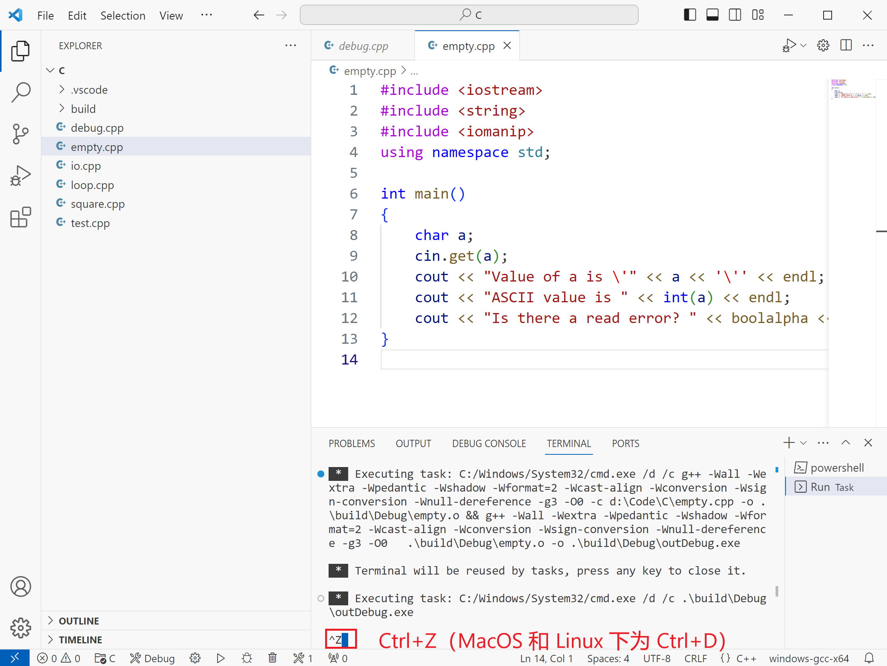

# 输入输出

输入输出（I/O）这个概念你应该听过很多次了，但是，到底啥是输入输出呢？你可以把我们的程序看成是一个黑盒子，盒子上有一个口，我们可以在纸上写一些字，然后扔进盒子里，那么这个过程就是输入。盒子收到我们的纸条并进行处理后，又从里面扔出另一张纸，那么这个过程就是输出。当然我们不一定就用纸这样传统的交流方式，更现代化一点，盒子上有键盘，你可以通过打字来输入，同时还有屏幕，其会随着你的操作而发生变化，输出不同的内容，没错，这就是电脑。

输入和输出不总是具体的数据，但我们可以将其抽象成由 `0，1` 组成的数据。想象一下电脑处理键盘输入的过程，假如我们按下 `A` 键，键盘会将这个动作处理成一个数字信号，假定是数字 `0`，然后发生给电脑。那么电脑收到 `0` 这个信号时，就理解了我们按下了 `A` 键。因此，有些时候你可以欺骗电脑，通过一些程序来向电脑发送 `0` 这个信号。这时，尽管你并没有真正按下 `A` 键，但电脑还是认为你按了 `A` 键，并作出相关的反应和输出。这就是鼠标宏和键盘宏的原理。

回到我们的 C/C++ 程序中，我们的输入和输出被大大简化了。输入可以看成是一个文本（字符串），我们的程序根据这个文本进行相关处理，又输出另一个文本。处理输入输出就相当于处理文本。

假如我们有一个文本（字符串） `1100`，那么根据 [ASCII 码]()，这段文本可以被转化为二进制数字序列 `00110001 00110001 00110000 00110000`，用十六进制可以简短地表示为 `31 31 30 30`。那么，假如我们直接把这个文本对应的原始二进制数存储到内存中，总共需要 4 个字节的空间，并且，其可以表示一个 int 型的变量，其值为 `825307184`。也就是说，对于一个 4 字节的数 `00110001 00110001 00110000 00110000`，如果你把它拆分成单独的 4 个字符，其可以表示字符串 `1100`；如果你直接把它看作一个 4 字节的整数，那么它就是数字 `825307184`。这里我想强调的是解释数据的方法不同，得到的结果也不一样。

那么，计算机怎么知道如何将输入处理成我们想要的结果呢？答案就是通过变量的类型来决定。如果使用 `cin` 将 `1100` 输入到一个 int 型的变量中，我们得到的是一个值为 `1100` 的变量，对应的十六进制数为 `44C`。显然，输入的时候，计算机不是简单地将字符串 `1100` 对应的原始数据（十六进制表示，为简洁表示，我们后面表示二进制数时常会采用十六进制数） `31 31 30 30` 复制到我们的内存上。在读取输入的时候，计算机对这段数据进行了一些处理，转换成了 int 型对应值为 `1100` （内存上为 `00 00 04 4C`）的变量。

## 使用 cin 输入

尽管我们到现在才正式介绍 `cin`，但你应该已经使用过它很多次了。一般而言，使用下面的语句来进行输入。

``` cpp
cin >> a;
```

此外，你还可以连续使用 `>>` 运算符来输入多个数据，如下。

``` cpp
cin >> a >> b >> c;
//相当于
cin >> a;
cin >> b;
cin >> c;
```

`cin` 在读入数据时有一个特点，就是会忽略所有的空白字符，包括空格、换行符、制表符，因此，即便你的数据前面跟着一些空格、换行符和制表符也没关系，`cin` 可以跳过这些空白字符读入你需要的数据。

``` cpp
int a;
cin >> a;
cout << a;
```

**输入：**

```
 101
```

**输出：**

```
101
```

此外，`cin` 在读入数据时，会将尽可能多的符合条件的数据读入到变量中。举例而言，若我们的输入文本为 `1001sa as`，那么通过 `cin` 将输入文本读入到一个 int 型变量中，将会得到值为 `1001` 的变量。如果读入到 string 中，则会得到 `1001sa`，因为上面提到过 `cin` 会忽略空格，故从第一个字符开始直到遇到空格时，`cin` 发现没有更多可读入的字符，于是就终止读入，得到结果为 `1001sa` 的字符串。总结而言，`cin` 读入数据会忽略前导的空白字符，并以空白字符作为一次读入结束的标志。你可以复制下面的代码自己尝试不同的输入进行试验。

``` cpp
string a;
cin >> a;
cout << a;
```

**输入：**

```
1001sa as
```

**输出：**

```
1001sa
```

## cin.get 和 getline

忽略空格可以带来一些便利，但有时，我们就是想要保留空格，那应该怎么办呢？C++ 中还有另外两个常用于输入的函数 `cin.get` 和 `getline`。在此，你不需要了解函数的概念，你只需要知道如何使用即可。

`cin.get` 每次执行时都会从输入文本中获取单个字符。`cin.get` 获取字符后，我们需要用一个变量来保存它，因此，我们可以写出以下的代码。

``` cpp
char c;
cin.get(c); //cin.get 得到的字符保存到 c 中。
cout << "c is \'" << c << '\'' << endl;
cout << "And the value is " << int(c);
```

**输入：**

```
 a
```

**输出：**

```
c is ' '
And the value is 32
```

**输入：**

```

asdf
```

**输出：**

```
c is '
'
And the value is 10
```

::: details 拓展内容
此外 `cin.get` 还有另外一种使用方法如下；

``` cpp
char c;
c = cin.get();
```

我不推荐使用这种方法，首先，在这种用法中 `cin.get` 的返回类型是 int 型，将 int 型赋值给 char 型变量会发生类型转换，产生一些意想不到的问题。原因是 `cin.get` 不一定总是返回一个符合 char 型范围的值，如 `cin.get` 读取 `EOF` 时会返回 `-1`，这时，如果将其赋值给一个 char 变量，再打印输出会得到不可预知的结果。
:::

`getline` 是另外一个常用的输入函数，默认情况下，`getline` 会**不忽略任何字符地**读入一整行字符串，因此，你需要足够大的类型 string 来存储读入的字符串。使用方法如下：

``` cpp
string a;
getline(cin, a);
cout << a;
```

**输入：**

```
12345aa  asds
this is new line.
```

**输出：**

```
12345aa  asds
```

`getline` 函数中的第一个参数为 `cin`，表明其从 `cin` 读入，而第二个参数则为用于存储的变量。由于 `getline` 读入时没有忽略空格，故后续还需要对得到的字符串进行进一步处理。

## 输入流指针——我读到哪了？

你在打代码的时候，有没有注意到那个闪烁的竖线？你在键盘上敲字时，字符就从那个竖线源源不断地涌现出来。你应该清楚那个竖线的重要作用，它用来指示目前文本输入的位置，故我们把它称为输入光标。同样的，我们的程序在读取输入时，也有类似这样的光标，我们称之为**输入流指针**。输入流指针指示了输入的位置，从输入流指针开始往右直到输入结束都是有效的输入部分，而输入流指针左边的数据则是不会被读入的。

举例而言，有一个输入文本为 `1100stat`，开始的时候我们的输入流指针（用竖线 `|` 指示）应该在整个文本的前面，即 `|1100stat`，此时，使用 `cin` 读入一个 int 变量，则 1100 将会被读走，输入流指针往后移动，变为 `1100|stat`，这时继续使用 `cin` 读入一个 string 变量，于是输入流指针后移，变为 `1100stat|`。这个过程很简单，是吧？

再来更加复杂的例子。输入文本为 ` \nabc 123`，使用 `cin` 读入一个 string 变量，那么流输入指针将移动到 ` \nabc| 123`，但我们读入的字符串实际为 `abc`，原因就如我之前所说，`cin` 读入数据时会忽略前导的空白字符，同时也会以空白字符作为读入结束的标志。这时流输入指针移动到了空格之前，那么假如这时我们用 `cin.get` 读入一个字符，那么应该会得到空格。下面的程序可以验证我们的想法。

``` cpp
string a;
char ch;
cin >> a;
cin.get(ch);
cout << "value of ch is \'" << ch << '\'' << endl;
cout << "ASCII value is " << int(ch);
```

**输入：**

```
 
abc 123
```

**输出：**

```
value of ch is ' '
ASCII value is 32
```

从上面的例子可以看到，使用 `cin.get` 读入字符时，要注意流输入指针的位置，因为 `cin.get` **不会忽略空白字符**！如果你不注意的话可能会读入一个空白字符，从而影响你程序的后续运行。

`getline` 读入时会读入一整行文本，但**不会读入换行符**，此外，读入完成后，流输入指针会**移动到换行符之后**。以下的程序可以验证 `getline` 的读入机制。

``` cpp
string str;
char ch;
getline(cin, str);
cin.get(ch);
//假定输入是 abcc\n!
//如果 ch 读入的值是 \n，说明 getline 读入完成后，流输入指针会移动到换行符之前，
//否则如果读入的值是 !，说明 getline 读入完成后，流输入指针会移动到换行符之后。
cout << "value of ch is \'" << ch << '\'' << endl;
cout << "ASCII value is " << int(ch);
```

**输入：**

```
abcc
!
```

**输出：**

```
value of ch is '!'
ASCII value is 33
```

## 读入了一个错误的类型

### 错误读取

你有没有想过，如果 `cin` 读入了一个错误的数据会发生什么？比如，如果我把 `a` 读入到一个 `int` 型的变量中。

``` cpp
int a = -1;
cin >> a;
cout << a;
```

如果我们的**输入为：**

```
a
```

**输出：**

```
0
```

再多来几组测试，**输入：**

```
b
+
?
=
```

**输出：**

```
0
0
0
0
```

可以看到，不管我们输入什么，上面的程序始终输出 `0`。

如果在读入多个数据时出错呢？

``` cpp
int a = -1;
int b = -1;
cin >> a >> b;
cout << a << ' ' << b << endl;
```

**输入：**

```
a 1
```

**输出：**

```
0 -1
```

显然，`a` 读入了错误的数据后被赋予了值为 `0`，而 `b` 似乎根本没有被读入。

假如我们尝试把错误的数据“读走”。

``` cpp
int a = -1;
int b = -1;
char c = '\0';
cin >> a >> c >> b;
cout << a << ' ' << b << endl;
cout << "Value of c is: " << c;
```

**输入：**

```
a 1
```

**输出：**

```
0 -1
Value of c is: *
```

看来和我们想的不一样，错误的数据并没有被读入到 `c` 中。

### cin.fail

`cin` 自身保存了一个 bool 型数据，用于指示我们读入是否出现了问题。通过使用 `cin.fail()` 来得到这个数据，注意，不要漏了括号。

``` cpp
int a = -1;
cin >> a;
cout << a << endl;
bool state = cin.fail();
cout << "Is there a read error? " << boolalpha << state; //boolalpha 可以将 bool 型变量输出为 true 或 false，如果不加上 boolalpha 则只会输出 1 或 0。
```

**输入：**

```
a
1
```

**输出：**

```
0
Is there a read error? true
1
Is there a read error? false
```

### 文件结束符 EOF

EOF（End Of File）就是文件结束的意思，你可以把它想象成一个特殊的字符，并且它会紧跟在文件的末尾之后。因此 EOF 可以用来表示我们在读入文件时是否达到文件的末尾。

你是否好奇将 EOF 读入一个变量中会发生什么？我们用下面的程序实验以下。

``` cpp
char a;
cin.get(a);
cout << "Value of a is \'" << a << '\'' << endl;
cout << "ASCII value is " << int(a) << endl;
cout << "Is there a read error? " << boolalpha << cin.fail();
```

**输入：**

```

```

**输出：**

```
Value of a is ''
ASCII value is 0
Is there a read error? true
```

在此，我们的输入为空，在程序终端中，想要结束输入，可以通过在一行的行首输入 `EOF` 字符来实现，`EOF` 在 `Windows` 系统下可以按 `Ctrl+Z` 键输入，在 MacOS 或 Linux 系统下按 `Ctrl+D` 输入。



上面的程序中的输出告诉我们读入 `EOF` 时失败了。在你的 IDE 里打出 `EOF`（不是 `Ctrl+Z`），然后将鼠标悬浮到它上面，你就可以看到 `EOF` 字符的定义。在我的电脑上，它被定义为值为 `-1` 的 int 型的量。显然，`EOF` 并不是 ASCII 码内的任何一个字符，因此，如果你试图将 `EOF` 读入到 char 中会发生读入错误。不仅仅是 char，EOF 读入到任何类型中都会发生读入错误。反之，在没有任何输入结束的提示符，且输入的数据长度不定时，我们可以利用读入错误来判断我们的输入是否已经结束了。

::: tip 问题
输入一些英文单词，单词间使用空格间隔开，请你统计输入单词的数量

**示例输入：**

``` cpp
Artificer is capable of blow up other creatures
```
**示例输出：**

``` cpp
8
```
:::

首先，我们使用 `cin` 读入一个 string，然后检查 `cin.fail` 的状态，如果读入成功，则答案计数加 `1`，然后继续循环读入下一个 string，再次判断 `cin.fail` 的状态。如果发生读入错误，则退出循环，输出结果。

::: details 查看参考代码
``` cpp
string str;
int ans = 0;
while (true)
{
    cin >> str;
    if (cin.fail() == true)
        break;
    ++ans;
}
cout << ans;
```
:::


## 格式化输入输出

### 输出整数

在输出整数时，我们可以指定其以八进制、十进制或是十六进制输出。例如

``` cpp
cout << oct << 88; //以八进制输出。
```

**输出：**
```
130
```

上面代码中的 `oct` 称为操作符，`<< oct` 并不会输出任何实际内容，它的作用是设定输出的格式。C++ 中提供了三种操作符用于整数的输出。

|操作符|说明|
|:---:|:---:|
|oct|八进制（octal）|
|dec|十进制（decimal）|
|hex|十六进制（hexadecimal）|

**样例：**

``` cpp
cout << oct << 18 << endl;
cout << dec << 87 << endl;
cout << hex << 1100;
```

**输出：**

```
22
87
44c
```

注意，设定输出进制的效果是持久的。也就是说，`cout << hex << 10 << ' ' << 32` 的输出结果为 `A 20`。操作符会持续影响后面的输出。此外，如果你想让输出的整数带有进制前缀，可以使用 `showbase` 操作符。

``` cpp
//showbase 和 hex 的顺序没有特别要求，只需保证在输出前即可实现格式化输出。其他的操作符也是同理。
cout << showbase << hex << 1100;
```

输出：
```
0x44c
```

如果你厌倦了显示进制前缀，则使用 `noshowbase` 即可。

### 输入整数

除了输出，`oct`，`dec` 和 `hex` 还允许我们使用特定进制输入整数，默认情况下以十进制输入整数。只需在 `cin` 中设置这些操作符即可。

``` cpp
int a;
int b;
int c;
cin >> a >> oct >> b >> hex >> c;
cout << a << ' ' << b << ' ' << c;
```

**输入：**

```
1234 2322 4d2
```

**输出：**

```
1234 1234 1234
```

### 输出浮点数

适用于浮点数的操作符如下表。

|操作符|说明|
|:---:|:---:|
|fixed|定点表示|
|scientific|科学计数法表示|
|hexfloat|十六进制浮点数|
|defaultfloat|默认格式|

``` cpp
cout << fixed << 123.45678 << endl;
cout << scientific << 123.45678 << endl;
cout << hexfloat << 123.45678; //不需要掌握
```

**输出：**
```
123.456780
1.234568e+02
0x1.edd3be22e5de1p+6 
```

默认格式下，`cout` 会在 `fixed` 和 `scientific` 间自动选择一种合适的格式输出浮点数。

### 浮点数的精度

要想指定浮点数输出的精度，需要使用 `setprecision` 操作符。`setprecision` 操作符接受一个整数用于指定输出的精度。

``` cpp
cout << setprecision(2) << 12.3456789 << endl;
cout << setprecision(6) << 12.3456789;
```

**输出：**

```
12
12.3457
```

从上可以看到，精度的含义是“有效数字”。但如果我们将浮点数指定为 fixed 或 scientific 输出时，精度的含义会变化为“保留的小数点后的位数”。

``` cpp
cout << fixed << setprecision(2) << 12.3456789 << endl;
cout << scientific << setprecision(6) << 12.3456789;
```

**输出：**

```
12.35
1.234568e+01
```

浮点数的精度的定义如下表：

|输出格式|精度意义|
|:---:|:---:|
|defaultfloat|数字的个数（有效数字）|
|fixed|小数点后的数字个数|
|scientific|小数点后的数字个数|

此外，默认情况下，浮点数的精度为 `6`。

::: warning 注意
`setprecision` 包含在头文件 `iomanip` 中，使用时需要引入头文件 `iomanip`。此外，部分格式化相关的操作符也包含在 `iomanip` 中，如果你想要使用格式化操作符，建议引入此头文件。
:::

### 显示浮点数小数部分后导 0

浮点数以 `defaultfloat` 格式输出时，会忽略小数部分的后导 `0`。如输出 `1.0` 时会变为 `1`，输出 `2.2300` 时会变为 `2.23`。要想显示后导 `0`，可以使用 `showpoint` 操作符。

``` cpp
cout << 1.0 << endl;
cout << showpoint << 1.0;
```

**输出：**
```
1
1.00000
```

输出的后导 `0` 的个数受到 `setprecision` 的影响。如果你不想再显示后导 `0`，可以使用 `noshowpoint` 操作符。

由于以 `fixed` 和 `scientific` 格式输出的浮点数受精度的影响，会始终显示后导 `0`，故 `showpoint` 操作符对其不起作用。

### 域

setw 操作符可以指定输出时的字符宽度（输出字符不足时用空格补齐）。其接受一个整数用于指定宽度。

``` cpp
cout << "********|********" << endl;
cout << setw(8) << 1.02 << '|' <<  setw(8) << "double" << endl;
cout << setw(8) << 35 << '|' <<  setw(8) << "int" << endl;
cout << setw(8) << "\'a\'" << '|' <<  setw(8) << "char" << endl;
cout << setw(8) << "\"hello\"" << '|' <<  setw(8) << "string" << endl;
```

**输出：**
```
********|********
    1.02|  double
      35|     int
     'a'|    char
 "hello"|  string
```

当输出的数据的长度比 `setw` 设置的宽度要长时，`setw` 不会起作用。

``` cpp
cout << setw(2) << "123456789";
```

**输出：**
```
123456789
```

默认情况下，setw 的输出采用右对齐的方式。如果你想切换对齐方式，可以使用 `left`（左对齐）或 `right`（右对齐）操作符。

``` cpp
cout << "********|********" << endl;
cout << left;
cout << setw(8) << 1.02 << '|' <<  setw(8) << "double" << endl;
cout << setw(8) << 35 << '|' <<  setw(8) << "int" << endl;
cout << setw(8) << "\'a\'" << '|' <<  setw(8) << "char" << endl;
cout << setw(8) << "\"hello\"" << '|' <<  setw(8) << "string" << endl;
```

**输出：**

```
********|********
1.02    |double
35      |int
'a'     |char
"hello" |string
```

`setfill` 操作符还可以指定 `setw` 用于填充的字符。用于填充的字符需要传入 `setfill` 中。

``` cpp
cout << "********|********" << endl;
cout << setfill('-');
cout << setw(8) << 1.02 << '|' <<  setw(8) << "double" << endl;
cout << setw(8) << 35 << '|' <<  setw(8) << "int" << endl;
cout << setw(8) << "\'a\'" << '|' <<  setw(8) << "char" << endl;
cout << setw(8) << "\"hello\"" << '|' <<  setw(8) << "string" << endl;
```

**输出：**

```
********|********
----1.02|--double
------35|-----int
-----'a'|----char
-"hello"|--string
```

### 其他格式化操作符

下面是一些适用于整数和浮点数的格式化操作符。

|操作符|说明|
|:---:|:---:|
|showpos|显示数字的正号|
|noshowpos|默认，不显示数字的正号|
|uppercase|输出进制前缀或者科学计数法中的底数时使用大写字母|
|nouppercase|默认，使用小写字母|

``` cpp
cout << showpos << 1 << endl;
cout << uppercase << scientific << 1.23 << endl;
cout << uppercase << hex << 8381;
```

**输出：**

```
+1
+1.230000E+00
20BD
```

## C 风格的输入输出

### scanf 的返回值和读入报错

scanf 的函数原型为：

``` cpp
int scanf(const char *format, ... );
```

这意味着，`scanf` 是一个返回类型为 int 的函数。其返回值表示 `scanf `成功读入的变量的个数，如果读入第一个变量之前就发生读入失败（此时通常表现为读到了 `EOF`），那么将会返回 `EOF`。

``` cpp
int a;
int c;
int d = scanf("%d%d", &a, &c);
printf("Return value of scanf is %d", d);
```

**输入：**

```
输入 1：
1 1
输入 2：
a 1
```

**输出：**

```
输出 1：
Return value of scanf is 2
输出 2：
Return value of scanf is 0
```

``` cpp
int a;
int d = scanf("%d", &a);
printf("Return value of scanf is %d", d);
```

**输入：**

```

```

**输出：**

```
-1
```

利用 `scanf` 的返回值，可以实现长度不定的数据的读入。

``` cpp
int sum = 0;
int a;
while (scanf("%d", &a) != EOF)
    sum += a;
printf("%d", sum);
```

**输入：**

```
1 32 3 -8 3
```

**输出：**

```
31
```

### 格式化字符串

scanf 的接收的第一个参数**格式化字符串**可用来指示如何进行输入。格式化字符串由三部分组成：

1. 非空白字符
2. 空白字符
3. 格式字符

在读入时，scanf 会将格式化字符的非空白字符与输入文本进行比较，若他们无法匹配，读入会失败。

``` cpp
int a = -1;
int state = scanf("Input number:%d", &a);
printf("Read state: %d\n", state);
printf("Value of a is %d", a);
```

**输入：**

```
输入 1：
10
输入 2：
input number:10
输入 3：
Input number:10
```

**输出：**

```
输出 1：
Read state: 0
Value of a is -1
输出 2：
Read state: 0
Value of a is -1
输出 3：
Read state: 1
Value of a is 10
```

格式化字符串中的空白字符会导致 scanf 忽略掉输入中连续的空白字符。

``` cpp
char a;
char b;
char c;
scanf("%c%c %c", &a, &b, &c);
printf("a is \'%c\'\nASCII value is %d\n", a, a);
printf("b is \'%c\'\nASCII value is %d\n", b, b);
printf("c is \'%c\'\nASCII value is %d\n", c, c);
```

**输入：**

```
a      1
```

**输出：**

```
a is 'a'
ASCII value is 97
b is ' '
ASCII value is 32
c is '1'
ASCII value is 49
```

格式字符，如 `%d`，`%c`，`%f` 等用于说明输入的方式。想必你已经掌握了，在此我不再介绍了。