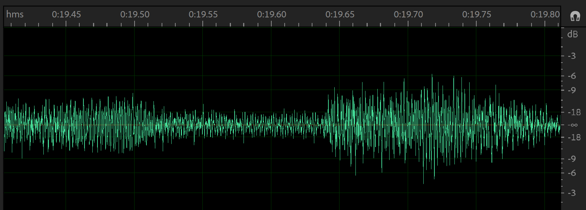
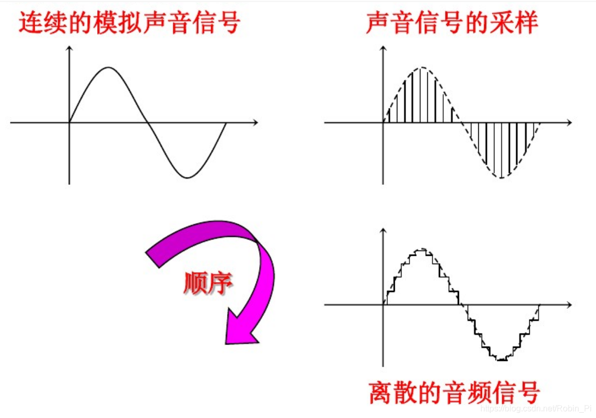
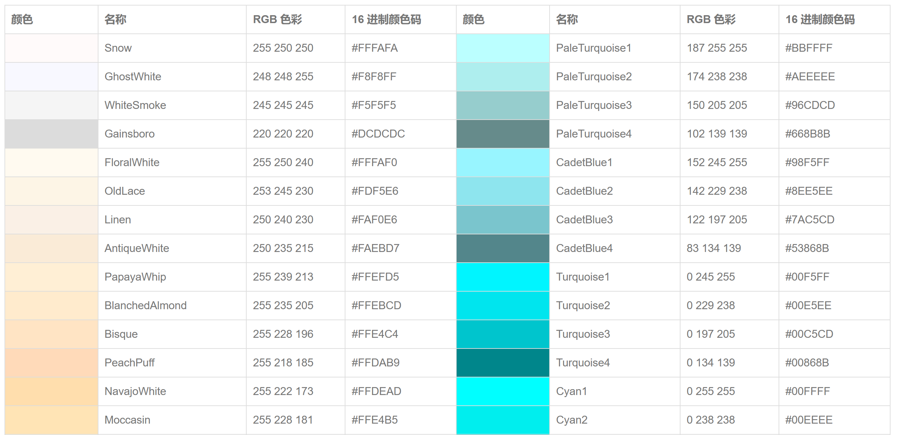
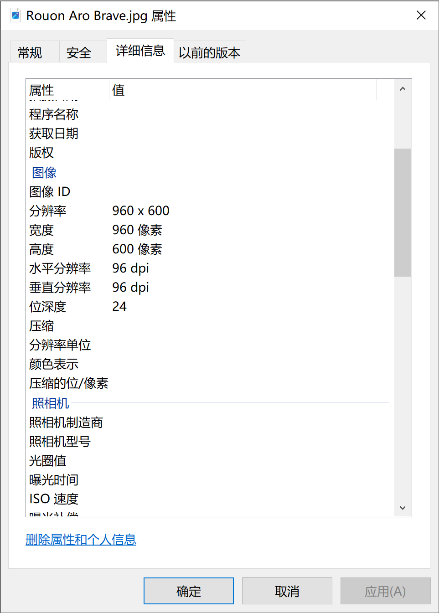

# 编码

## 数据，信息与编码

我们知道，计算机内的数据全部是以二进制数存储的。而诸如文本，图像，声音等各类丰富的信息首先需要转换为一系列的二进制数才能放到计算机内进行存储，而处理这些数据就需要依赖编码。

数据本身是没有意义的！数据经过加工处理后得到的信息才是有意义的！给你一串数据，如 `49206C6F766520594F55`，你多半是一头雾水，但假如告诉你以十六进制 ASCII 码的形式分割前面的数据，那么就会得到富有一定信息的文本 `I love YOU`。ASCII 码就是在计算机里广泛应用的最典型的字符编码。

## 计算机内数据的编码

### 原码，反码和补码

数在计算机中以二进制的形式存储。通常，一个二进制数由符号位和数值位组成，一般来说，二进制数的最高位用来表示符号位，0/1 分别对应正/负数。例如 4 位有符号二进制数 1001 表示十进制数 -1。原码就是数据本身。

反码：正数的反码是其本身，负数的反码符号位不变，各位取反。

补码：正数的补码是其本身，负数的补码符号位不变，各位取反后再加 1。

例如，对于 4 位有符号数 1001，其反码为 1110，补码为 1111。8 位有符号数 00000000，反码和补码都为 00000000。

从补码转化成原码，只需要再进行一次补码变换即可。

在计算机中，整型数据通常以补码的形式存储。使用补码是因为其在运算方面可以带来效率上的提高。C/C++ 中的整型数就是以补码的形式存储的，下面一段程序就可以输出 -1 的补码。

``` cpp
int a = -1;
for (unsigned char *p = reinterpret_cast<unsigned char*>(&a + 1) - 1; p >= reinterpret_cast<unsigned char*>(&a); --p)
{
    cout << uppercase << setw(2) << setfill('0') << hex << int(*p);
}
```

输出：

```
FFFFFFFF
```

## 字符编码

### ASCII 码

字符编码可以看作是字符集（Character Set）到二进制数之间的一种映射，例如 [ASCII 码](/table/ASCII)。其规定了从数字 0 到 127 对应的字符。

ASCII 码有以下特点：

- 字符 0 到 9 ，A~Z，a~z 在编码上是连续的
- 只有第 32~126 个字符是可见的，称为可打印字符，第 0~31 个字符和第 127 个字符是不可见的，被称为控制字符，用于其他功能
  
表示一个 ASCII 码只需要 7 位二进制数，但在计算机中通常使用一个字节（8 位二进制数）来存储 ASCII 码，剩下一位用于其他目的，如校验。

ASCII 码仅仅规定了从数字 0 到 127 对应的字符。很显然，ASCII 码对于除了英语以外的语言都是不够用的，因此出现了其他的编码形式。

### GBK 编码

1980 年，我国发布了第一个汉字编码标准，也即 GB2312 ，全称《信息交换用汉字编码字符集·基本集》，通常简称 GB（“国标”汉语拼音首字母），共收录了 6763 个常用的汉字和字符，此标准于次年5月实施，它满足了日常 99% 汉字的使用需求。

1995 年，在 GB2312 的基础上进行修改，对部分汉字进行简化，并扩充了日语和韩语中的部分汉字，发布了 [GBK](https://www.toolhelper.cn/Encoding/GBK) ，全称 《汉字内码扩展规范》。

GBK 采用固定长度 2 个字节编码汉字，并且 GBK 对 ASCII 码进行了兼容。绝大多数国内销售的 Windows 计算机都采用 GB2312 编码。因此，在你写的 C/C++ 程序中，假如有一个 C 风格的字符串 `你好，世界！`，那么其应该占用 13 个字节的存储空间。

### Unicode 字符集和 UTF

> Everyone in the world should be able to use their own language on phones and computers.

[Unicode](https://home.unicode.org/) 是国际标准字符集，它将世界各种语言的每个字符定义一个唯一的编码，以满足跨语言、跨平台的文本信息转换。目前来说，Unicode 是互联网上使用最广泛的字符集。

Unicode 字符集的编码范围是 0x0000~0x10FFFF，故其可表示 100 多万个字符。假如每个 Unicode 字符都用 3 个字节存储，那么对于原本完全使用 ASCII 码编码的文件，其占用存储空间大小会直接翻 3 倍，这肯定是不能接受的。

Unicode 仅仅规定了字符集，但是没有规定具体的字符存储和编码方法。UTF（Unicode Transformation Format）才是 Unicode 编码的实现。Unicode 编码有多种，如 UTF-8，UTF-16，UTF-32。其中使用比较多的是 UTF-8。UTF-8 使用变长的字节数来表示字符，一个字符可能占用 1 字节，也可能是 2 字节或是 3 字节。而汉字字符在 UTF-8 下通常占用 3 字节的长度。

### 乱码

如果文本以不合适的编码打开，那就很可能出现乱码。如果你使用 Visual Studio 编写程序，你可能会在程序输出中看到“烫烫烫”，原因是在 MSVC 中，变量若不初始化，则会用 C（十六进制）填充变量的各个字节，而 GB2312 编码中，0xCCCC 对应的字符刚好就是“烫”。“锟斤拷”也是乱码的另外一个例子。


## 音频

声音可以用波来表示。通常来说横坐标用于表示时间，纵坐标表示声音的响度（波的振幅）。



声波信号是连续变化的信号，这样的信号称为模拟信号（Analog Signal），相反，不连续的，也就是离散的信号称为数字信号（Digital Signal）。在计算机中，由于数据的存储是离散的，故需要将声波切割成一个个数据点。也就是说，我们需要一种将模拟信号转化成数字信号的方法，一般通过采样，量化，编码等步骤来实现模拟信号向数字信号的转化。简单说，对于一段连续变化的信号，我们可以每隔一段固定的时间读取一次信号的强度，得到一段的信号强度序列，便可以将其存储在计算机内。



每秒钟读取信号的次数定义为采样频率，每个采样值占用的空间大小称为采样大小。此外，为了能还原真实的声音场，音频还可能包含多个声道。那么，一段音频占用的存储空间大小可以用下列公式计算。

<LatexDisplay>占用空间=采样大小\times采样频率\times时长\times声道数</LatexDisplay>

例如，对于一段长为 3 分钟，采样频率为 48000 Hz，单精度浮点数（32 位浮点数）采样的双声道音频，其占用的空间大小为 4×48000×180×2=69120000 B = 65.92 MB。

常见的音频文件格式有：mp3，wav，flac 等。

## 图像

首先我们来认识图像。在计算机中，你从屏幕上所看到的图像实际上是由一个个小方格组成的，单个方格的颜色完全相同。在计算机上打开图片并不断放大，你就会看到图片逐渐失真并逐渐颗粒化。放大到足够大时，你就能看到一个个的颜色方格。这样的小方格被称为像素。

存储图像所需要的像素数称为分辨率，一般用水平方向上的方格数乘上竖直方向上的方格数表示。例如，我的显示器的分辨率为 3000×2000。很显然，分辨率越高，图像的质量也就越好。经常刷视频的人应该对分辨率很熟悉，一般视频的分辨率如 360P，480P，720P，1080P 等，实际上就是对应分辨率的简写：480×360（4:3），640×480（4:3），1280×720（16:9），1920×1080（16:9）。视频的分辨率越高，相应的清晰度也就越好。

每个像素都表示一个单独的颜色。假如我们只需要表示黑白两种颜色，那么一个像素只需要占用 1 Bit 的空间；如果每个像素占用 3 字节的大小，那么其就能表示 16777216 种颜色。图片中每个像素所用于表示颜色的存储空间位数称为图像的位深度。早期的图像由于技术限制，只能使用灰度来表示颜色，在计算机中使用 8 位位深度来显示一个图片。


现代计算机中的颜色一般使用 24 位位深度来表示，通常由红、绿、蓝三种颜色按照一定比例混合所得。24 位中的前 8 位，中间 8 位，后 8 位分别表示红色通道，绿色通道和蓝色通道的强度，这样的颜色模型称为 RGB 颜色。因此，在计算机里，一种颜色通常可以用一串十六进制数的代码来表示。



如果感兴趣，你可以打开这个[网站](https://www.codeeeee.com/color/picker.html)玩一玩。

那么，未经压缩的图片占用的大小可由下面的公式计算。注意位深度单位是 Bit！

<LatexDisplay>\text{占用空间}=分辨率\times位深度</LatexDisplay>

例如，对于下面的图片，在详细信息中可以看到其分辨率为 960×600，位深度为 24 位，那么假如未经压缩，其占用的存储空间为 3×960×600 = 1687.5 KB。




::: details
[https://www.pixiv.net/artworks/51076296](https://www.pixiv.net/artworks/51076296)
画师：zoharwolf
:::

上面通过像素方格来显示图像，这样的图像被称作位图，或是点阵图，栅格图像。另外一种常见的采用与位图完全不同方式来显示图像的是矢量图。矢量图由一系列的几何特征来描述图像，因此，其在放大后也不会出现失真，清晰度下降的现象。

常见的图像格式有 bmp，jpg，gif，png 等。

## 视频

视频实质上是运动的图像。在 1 秒中内，通过不断切换一系列的静态图像，你就会感觉到图像中的物体等好似在运动，但本质上只是静态图像切换所造成的视觉错觉。组成视频的单个图片称为帧（Frame），每秒钟视频所显示的图片数称为视频的帧率，也叫帧每秒（Frame per Second，缩写为 fps）。一般来说，视频的帧率在达到 24 以上时，人眼就很难在区分了。

除了图像部分，视频通常还包含音频部分。那么一个视频占用的空间可以用以下公式表示。

<LatexDisplay>占用空间=帧率\times时长\times单帧图像大小+音频大小</LatexDisplay>

不考虑音频部分和压缩，一个 1080P（分辨率为 1920×1080），真彩色（位深度为 24），24 fps，时长 5 分钟的视频占用的空间大小为 3×1920×1080×24×300 = 42714.84 MB。可见，如果视频未经压缩，其占用的存储空间是相当大的。

常见的视频文件格式有：avi，mpg，mpeg，mp4 等。