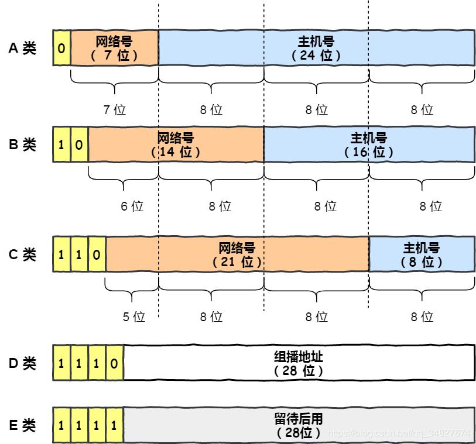
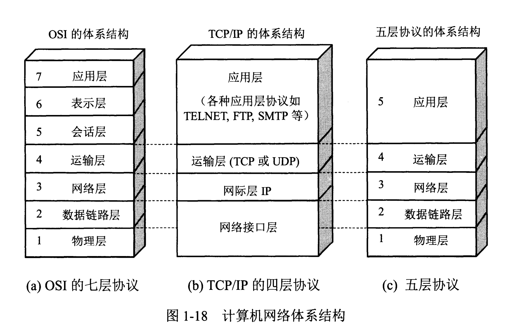
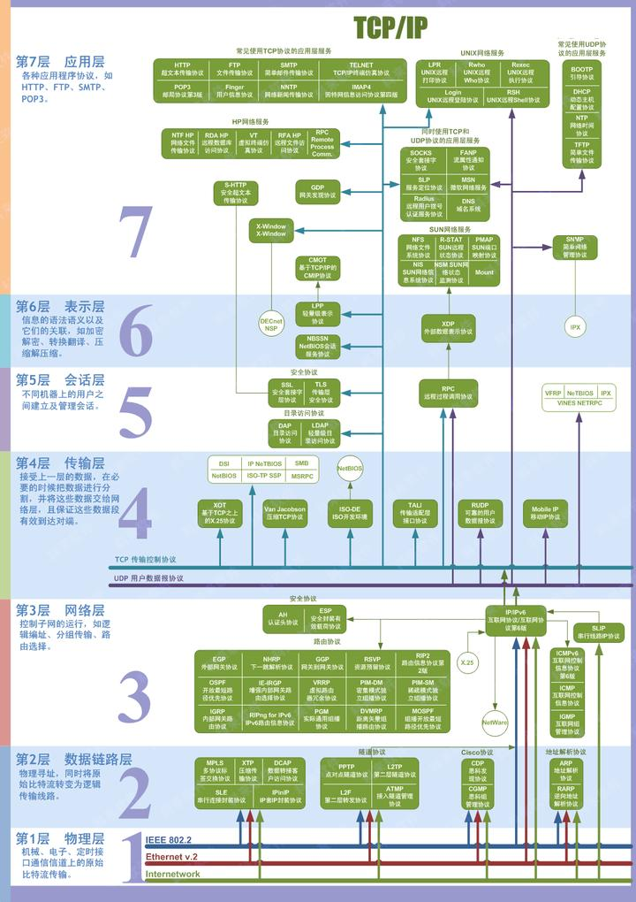
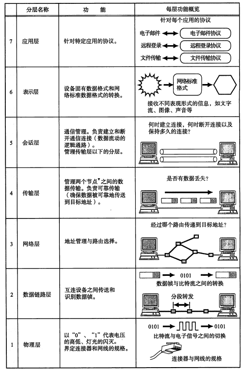
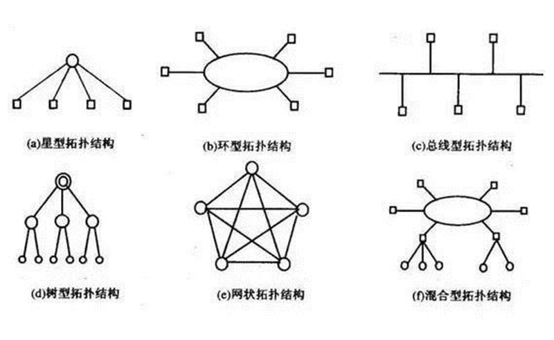
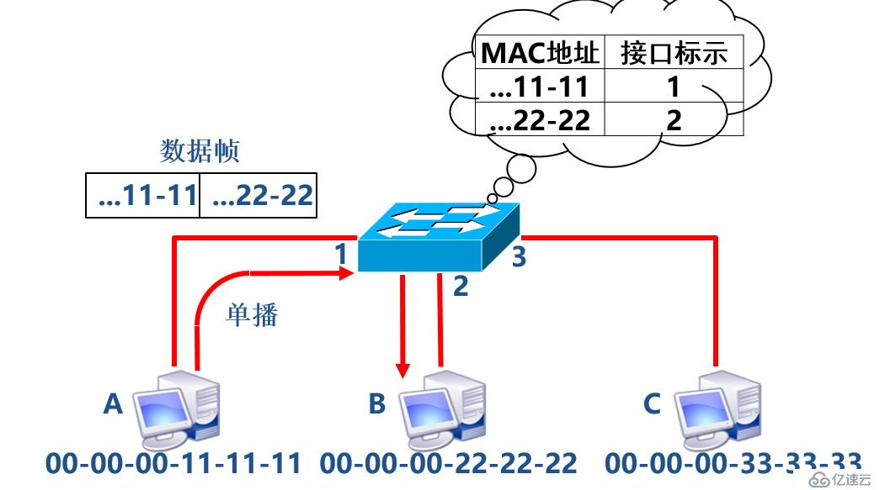

# 计算机网络

## 计算机网络分类

> 计算机网络由两台或多台计算机组成，这些计算机通过电缆（有线）或 Wi-Fi（无线）连接，目的是传输、交换或共享数据和资源。您使用硬件（如路由器、交换机、访问点和电缆）和软件（如操作系统或业务应用程序）构建计算机网络。

按照网络大小，我们可以将计算机网络分为局域网（LAN，Local Area Network），广域网（WAN，Wide Area Network）和城域网（MAN，Metropolitan Area Network）。

局域网的范围最小，通常家庭，办公楼和学校范围内的组建的网络属于局域网；广域网在很大的区域组建网络，如国家与国家，大洲与大洲之间；城域网则的大小则介于广域网和局域网之间。

## IP 地址

在计算机网络内，需要给每台计算机一个地址，用来唯一标识此计算机。[IP 地址](https://zh.wikipedia.org/wiki/IP_address)用于标识设备的主机网络以及设备在主机网络上的位置。一个 IP 地址由 32 位二进制数表示，为了便于记忆，通常使用点分十进制数的方法记录 IP 地址，如 `192.168.1.1`，每个分割数为一个字节。

根据地址范围，IP 地址被分为 5 类。划分依据为 IP 地址的第一个字节。

- A 类：1-126 默认子网掩码：`255.0.0.0`
- B 类：128-191 默认子网掩码：`255.255.0.0`
- C 类：192-223 默认子网掩码：`255.255.255.0`
- D 类：224-239 组播地址
- E 类：240-254

IP 地址中的网络地址（网络号）唯一标识网络，其由 IP 地址和子网掩码进行按位与操作得到。网络地址可以用于判断两台主机是否在同一网络下。主机地址（主机号）则唯一标识一台主机。对于 C 类地址，主机地址由 8 位数组成，故最多能容纳 256 台主机（不考虑特殊地址）。

IP 地址的部分地址为特殊地址，不用来标识一台主机，而用于一些特殊用途。

- 网络地址：网络地址唯一标识网络，其主机地址（主机号）部分为 0，如 `120.0.0.0`。
- 直接广播地址：主机地址各位全部为 1 的地址。表示向网络上的所有主机发送报文。如 C 类地址的直接广播地址为 `192.168.1.255`。
- 受限广播地址：`255.255.255.255`。

因此，由于特殊地址的存在，一个 C 类地址最多能容纳 254 台主机（例如，从 `192.168.0.1` 到 `192.168.0.254`）。

还有一类特殊的地址称为私有地址，包括 `10.*.*.*`，`172.16.*.*` 到 `172.31.*.*` 和 `192.168.*.*`。私有地址不能在互联网上使用，其一般保留下来用于组建子网。

一个 IP 地址所能容纳的地址约为 40 亿，假如给地球上的每个人都分配一个手机，那么 IP 地址也是不够用的，因此产生可以容纳更多地址数的 IPv6，其由 128 位二进制数表示。一般使用冒号分割十六进制数表示一个 IPv6 地址，如 `240c:c001:1004:564f:3162:c0cc:d6a2:5dc7`，每个分割为 2 字节。IPv6 所能存储的地址数为 2 的 128 次方，理论上这个数可以看作无穷大了，IPv6 甚至可以给地球上的每粒沙子分配一个地址。使用 32 位表示的 IP 地址为 IPv4，其为旧的 IP 协议，而 IPv6 是新一代的 IP 协议，但出于许多原因，IPv6 尽管诞生了许多年，也仍未得到广泛普及。

## 域名， URL 和 DNS

IP 地址毕竟只是一串无意义的数字，并不便于记忆，因此在 IP 地址的基础上产生了[域名](https://developer.mozilla.org/zh-CN/docs/Learn/Common_questions/Web_mechanics/What_is_a_domain_name)（Domain Name）。域名是一种符号化的地址，如 baidu.com 为百度搜索的域名。

域名由多个部分组成，使用英文逗号分隔，不同于中文书写顺序，**它需要从右到左阅读。**最右端的部分称为顶级域名，其可以告诉用户域名所提供的服务类型，如 .com（Commercial，商业组织），.org（Organization，非营利性组织），.edu（教育机构）。顶级域名也可以用于指示地区，如 .cn，.us，.jp 等。位于顶级域名之前的称为二级域名，二级域名之前的为三级域名，依次类推。每个部分通常由英文字母组成。

域名只是一种助记手段，要想在计算机网络上建立通信最终还是得靠 IP 地址。将域名解析为 IP 地址需要依赖 [DNS](https://developer.mozilla.org/zh-CN/docs/Glossary/DNS)（Domain Name System，域名系统） 服务器。

类似于 IP 地址，[URL](https://developer.mozilla.org/zh-CN/docs/Learn/Common_questions/Web_mechanics/What_is_a_URL)（Uniform Resource Locator，统一资源定位符）用来唯一标识网络上的一个资源。你正在使用的浏览器的地址栏中所填写的内容实际上就是这个文档的这篇页面的 URL 地址。URL 一般由协议，域名，路径和其他部分（参数和锚点）组成。

## 计算机网络体系结构和协议

计算机网络体系结构分为 3 种：OSI 体系结构（七层），TCP/IP 体系结构（四层），五层体系结构。

- OSI 体系结构：概念清楚，理论也比较完整，但是它既复杂又不实用。
- TCP/IP 体系结构：TCP/IP 是一个四层体系结构，得到了广泛的运用。
- 五层体系结构：为了方便学习，折中 OSI 体系结构和 TCP/IP 体系结构。

为了使不同计算机之间能够正常进行网络通信，需要各种各样的协议。在计算机的体系结构不同层上运行着不同的协议。

其中 IP 协议（Internet Protocol）属于网络层，是最核心的协议之一。TCP 协议（Transmission Control Protocol）和 UDP 协议（User Datagram Protocol）属于传输层，用于管理节点之间的数据传输，其中 TCP 协议是面向连接的协议，通信双方必须建立可靠连接后才能进行数据传输，而 UDP 协议是非连接的协议，传输数据前传输双方不建立连接，传输时可能会出现丢包，是一种不可靠的连接。

应用层上的协议一般用于规范各类应用的数据。如 SMTP（Simple Mail Transfer Protocol）和 POP3（Post Office Protocol 3）是常用的电子邮件协议；FTP 协议（File Transfer Protocol，文件传输协议）是进行文件传输时的标准协议；HTTP 协议（HyperText Transfer Protocol，超文本传输协议）是用于获取超文本标记文件（HTML）的一种协议，HTTPS 是其更加安全的版本，也在目前的网站中广泛使用。

## 网络拓扑结构

常见的网络拓扑结构有以下几种。

每种结构各有其特点

- 总线型：结构简单，容易扩充；所有计算机共用同一线路，同一时间只有一个用户能传输数据；若总线断开，则整个网络都会断开。
- 星型：所有节点都和中央节点相连，易于网络监控和管理；单个节点（非中心节点）故障不影响整个网络；线路出现故障时容易维护。
- 环形：结构简单；单一节点故障会影响整个网络，可靠性低；节点过多时数据传输的响应时间会延长。
- 树形：结构简单，容易扩增；根节点故障时会影响整个网络。
- 网状：结构复杂，成本高；可靠性好。

## 计算机网络设备

网络设备是搭建计算机网络的必要部分。

### 网卡

网络接口卡（Network Interface Card,NIC），又称网卡或网络适配器，是计算机和网络的接口，承担数据打包发送和拆包接受的任务。一般的个人电脑都集成了网络适配器。

### 中继器

中继器（Repeater）主要功能是对数据进行再生和还原，对传输过程中发生衰减的信号放大，从而延长传输距离。

### 网关

网关（Gateway）用于实现不同网络间的数据传输。一个网络中通常会有一个网关。若 a 网络中的电脑 1 想要发生数据给 b 网络中的电脑 2，那么 1 需要先将数据包发送给 a 网络的网关，再由 a 的网关发送给 b 的网关，最后又由 b 的网关发送给 2。

### 路由器

路由器（Router）工作在 OSI 体系结构中的网络层，其根据传输数据包中的 IP 地址来确定合适的传输路径（路由功能）。路由器一般用来连接外网和内网（家用路由器一般有 WIFI 功能，用于搭建无线局域网），因此路由器具有网关的功能。

### 集线器

集线器（Hub）有多个端口，可以连接多台网络设备。集线器收到的数据包采用广播的形式转发，也就是说，数据包会被转发到连接到集线器的各个链路上。显然，这种转发方式存在许多缺点，例如数据容易被他人截取，安全性低。

### 交换机

交换机（Switch）识别数据包中的 MAC 地址，并根据其进行转发，相当于升级版的集线器。

### 传输介质

常用的组成网络中的链路的传输介质有双绞线，同轴电缆和光纤。双绞线抗干扰能力较弱，一般用于短距离的传输，通常你的计算机所用的网线就是双绞线。同轴电缆和光纤可用于长距离传输。