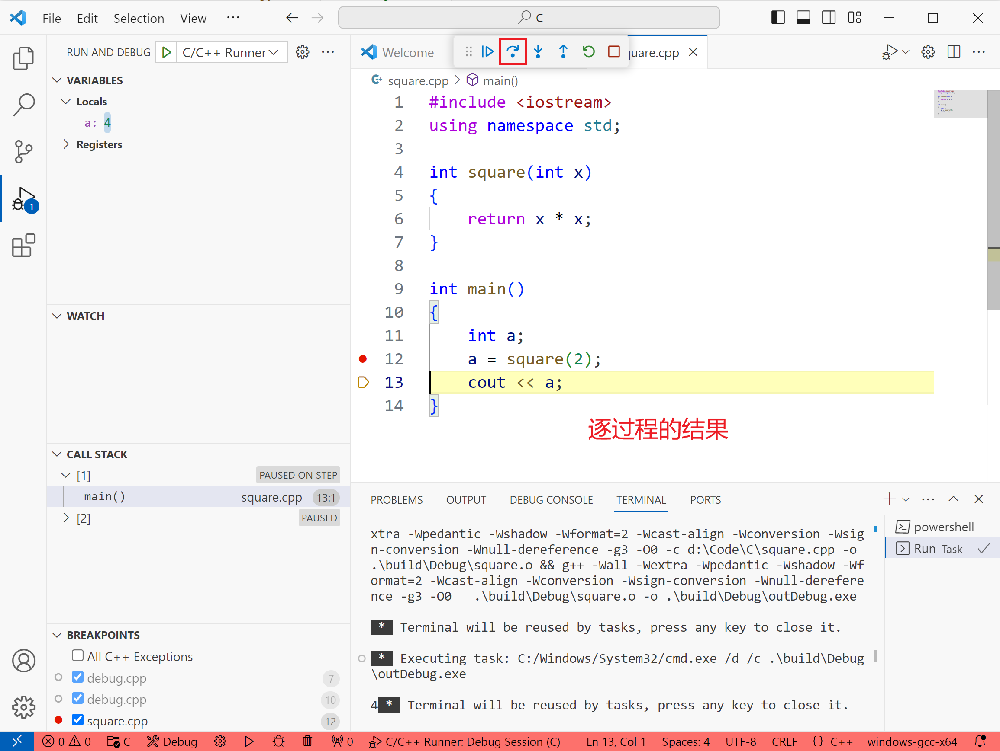
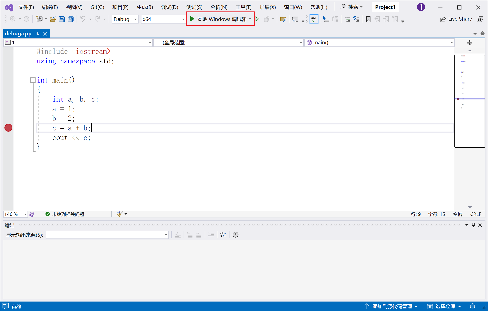

# 调试

调试（Debug）可以帮助我们检查代码中的错误，同时也是非常重要的检查代码运行状态的手段，下面我们以 VSCode 为例介绍如何进行调试。不同的 IDE 的调试方法大体上相同，因此如果你使用的 IDE 不是 VSCode 也不用担心，了解基本的调试思想后，再去熟悉操作也是可以的。

## 以 VSCode 为例

在 VSCode 打开你想要进行调试的代码，在此我们使用下面的加法程序。

``` cpp
#include <iostream>
using namespace std;

int main()
{
    int a, b, c;
    a = 1;
    b = 2;
    c = a + b;
    cout << c;
}
```

如果你安装了扩展 `C/C++ Runner`，那么编译完成后可以按下 `Ctrl+Alt+D` 进行调试。如果你没有此扩展，在左上方的菜单 `Run` 在下拉菜单中点击 `Start Debugging` 或者也可以直接按下快捷键 `F5`。进行调试后，我们可以看到下方的调试控制台输出了一些信息。现阶段我们可以不用在意调试控制台的信息，我们也不会用到调试控制台。

### 设置断点

运行调试后，我们看到有一个一闪而过的黑色窗口。这是因为开始调试后，我们的程序以很快的速度运行完毕并关闭了。为了关注我们感兴趣的地方，我们需要设置**断点**。例如，我们在 `c = a + b;` 这一行设置一个断点。首先，将鼠标移到这行的行号左边，我们看到出现一个虚化小红点，我们点击小红点，可以看到小红点实体化了，这样我们就成功设置了断点。


在此点击调试，这时我们看到 VSCode 窗口有了一些变化。首先断点所在的那一会高亮了，同时行号旁边出现了黄色小箭头。箭头的意义表示我们的代码已经执行到了本行之前。同时，左侧调试子窗口中出现了我们程序中的变量和他们目前的值。可以看到 `a = 1`，`b = 2` 与我们设定的值相同。


接下来，我们需要执行下一步 `c = a + b`。点击上方悬浮窗口中的 `Step Over`，黄色箭头移动到下一行，`c = a + b` 这一语句执行完毕，同时我们也可以在左边的窗口看到 `c` 的值变为了 `3`，与预期相符。


此外，将鼠标悬停在变量上方也可以直接查看这个变量的值。


再次点击 `Step Over`（或者按快捷键 `F10`），执行输出语句 `cout << c`。到这里你可能想问，我们的输入输出窗口在哪？如果你没有打开很多窗口的话，你应该已经注意到了，我们在开始调试的时候就出现了一个黑乎乎的窗口，这个窗口就是我们的输入输出窗口。在调试的时候，程序终端（输入输出窗口）会从 VSCode 的内置终端中分离出来，如果你不喜欢分离出来的窗口，可以参阅[如何在 VSCode 调试时使用内置集成终端](./VSCodeConfig.md#在调试时使用内置集成终端)。


可以看到，执行完成了，程序终端上输出了 `3`。到此，程序的所有语句都已经执行完了，再次点击逐过程（`Step Over`）我们的程序就会关闭掉，然后调试也会随之结束。

**断点的作用**就是当我们的代码执行到断点所在的位置时，程序将会停止，这时，我们可以观察各个变量的情况，检查程序的运行状况是否符合预期。

### 继续，单步进入与单步跳出

如果我们的程序很长，比如对于几百行的代码，你肯定不会期望点几百次 `逐过程` 来慢慢执行代码。因此我们需要使用 `继续`(`Continue`)。`继续` 功能需要配合断点使用。你可以在代码中设置多个断点，如图。当我们点击 `继续` 后，代码将会一直执行，直到命中下一个断点。


`单步进入`（`Step Into`）与 `逐过程` 很相似，区别在于 `单步进入` 将会试图进入函数，或者其他可展开的代码之中，而 `逐过程` 则跳过其执行的细节，达到下一行的语句中。这里虽然涉及到了[函数](/404)的概念，但即便你还没有学习函数也不用担心，相信你可以在之后理解这部分的内容。下面的演示中，我们需要用到一个带有函数的代码。

``` cpp
#include <iostream>
using namespace std;

int square(int x)
{
    return x * x;
}

int main()
{
    int a;
    a = square(2);
    cout << a;
}
```





与 `单步进入` 相反，`单步跳出`(`Step Out`)则从函数中跳出，返回到上一层调用者函数中。


### 结束调试

要想终止调试，需要点击 `停止`（`Stop`）按钮，仅仅关闭终端是不会结束调试的。


### 添加监视变量

如果你的程序里面有很多变量，你可能会被调试窗口里繁多的变量搞得眼花缭乱。添加监视变量可以让你把注意力集中在你感兴趣的变量上。在调试窗口的 `Watch` 栏中的 `Add Expression`（加号）按钮，然后输入变量的名称即可添加监视变量。进行调试，可以看到我们能够监视其变化。


### 带条件的断点

对于执行几十次甚至上百次的循环，如果你在其中设置断点的话每次循环都会命中断点，然而，有时你只想关注某个特殊情况下的断点，这时就可以使用条件断点。如图，鼠标悬停在 `断点` 上，右键，在下拉菜单中点击 `Edit Breakpoint..`。


然后可以输入一个表达式，表达式的语法与 C 的语法完全相同，当表达式的值为真时，断点才能被命中。在此，我们输入 `i == 5`。


再次编译调试，可以看到触发断点时，`i` 的值为 `5`。


你也可以使用更加复杂的例子，如下。


可以看到，在我们所设置的条件 `a >= 15 && i < 8` 下，断点被命中了两次。

### 捕获异常

### 切换调用栈

::: tip 拓展内容
本部分为拓展内容。
:::

<!-- 在函数递归中，我们的调试很容易在层层递归中失去方向。幸运的是，调试窗口中提供了调用栈，让我们可以在函数嵌套的各个层中来回切换，以查看不同调用栈内的情况 -->

## Visual Studio 调试操作

Visual Studio 的调试方法与 VSCode 基本完全相同（毕竟是同一个妈生的...）。在上方工具栏中点击 `本地 Windows 调试器` 即可进行调试。在调试模式下，工具栏中会出现调试相关的操作，使用快捷键或者点击即可进行相应操作。左下方的 `自动窗口` 可以监视变量的值，切换到 `监视` 选项单则可以添加监视变量。




## Dev-C++ 调试操作

::: warning 注意
在此，我还是要再次强调，不推荐使用 Dev-C++ 来编写代码。如果你打算使用 Dev-C++，那就继续往下看吧，或者考虑[安装使用其他的 IDE](/precede/Installation)。
:::

使用 Dev-C++ 调试之前，如图，先将编译器切换为 `TDM-GCC 4.9.2 64-bit Debug` 或 `TDM-GCC 4.9.2 32-bit Debug`。然后先点击 `编译` 然后点击调试。设置断点，继续，逐过程等操作与 VSCode 相同，不在赘述。

::: danger 注意
一定要先切换编译器再进行调试！在 Release 编译器下进行调试会致使 Dev-C++ 崩溃，损失你的代码进度！
:::


