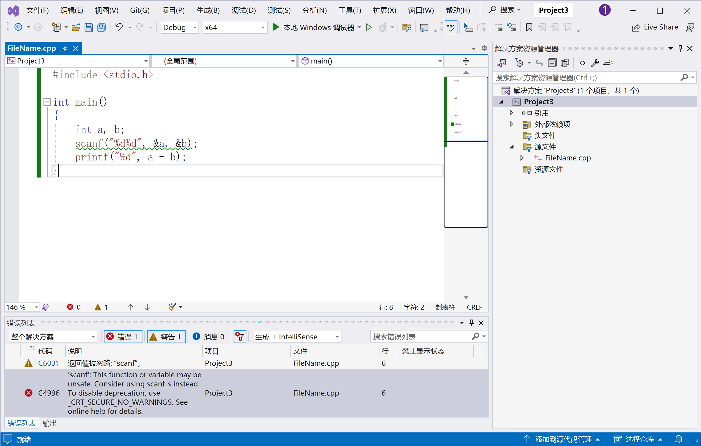
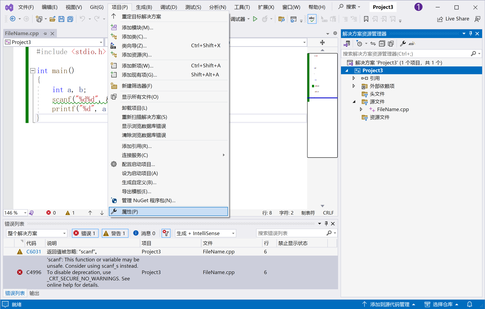
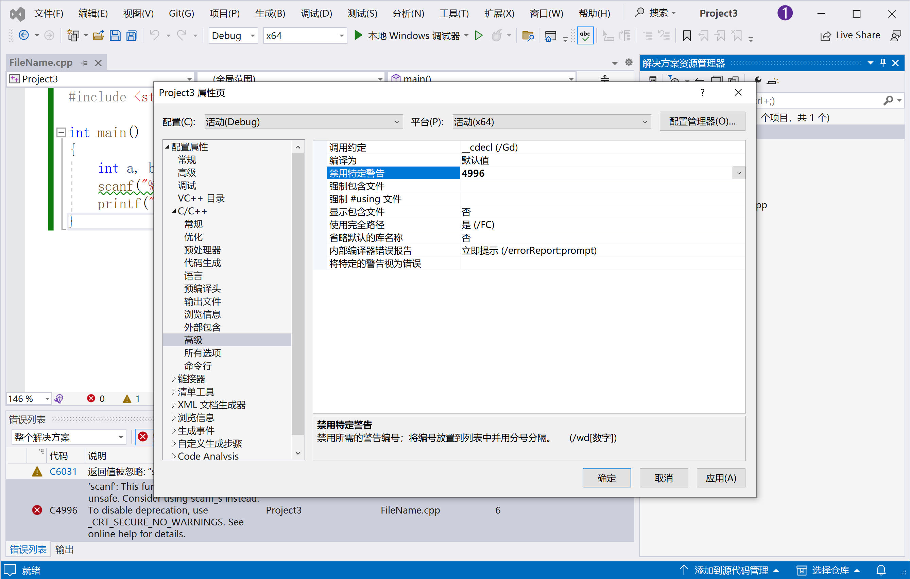
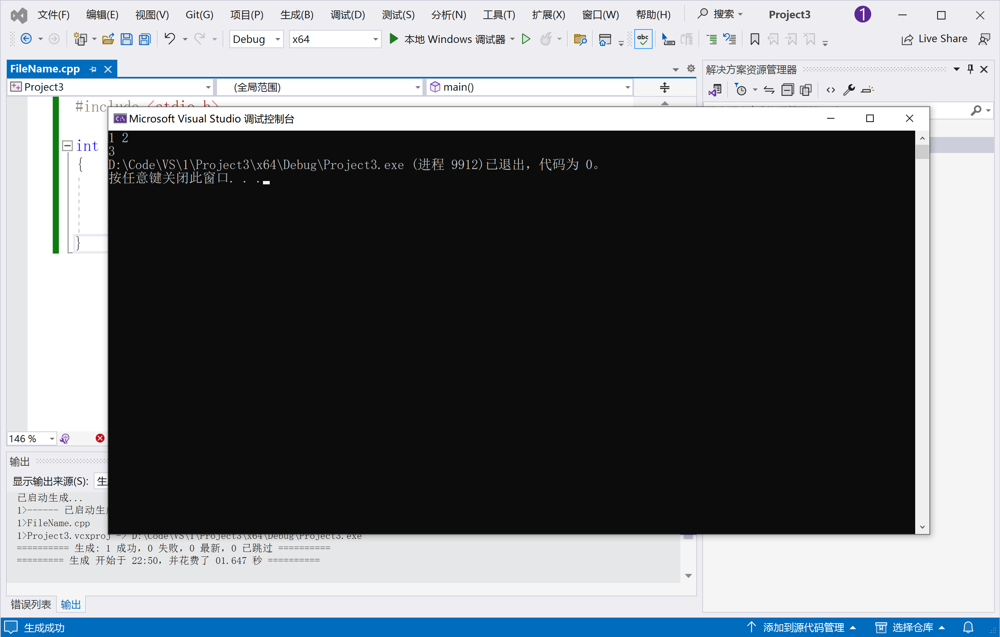
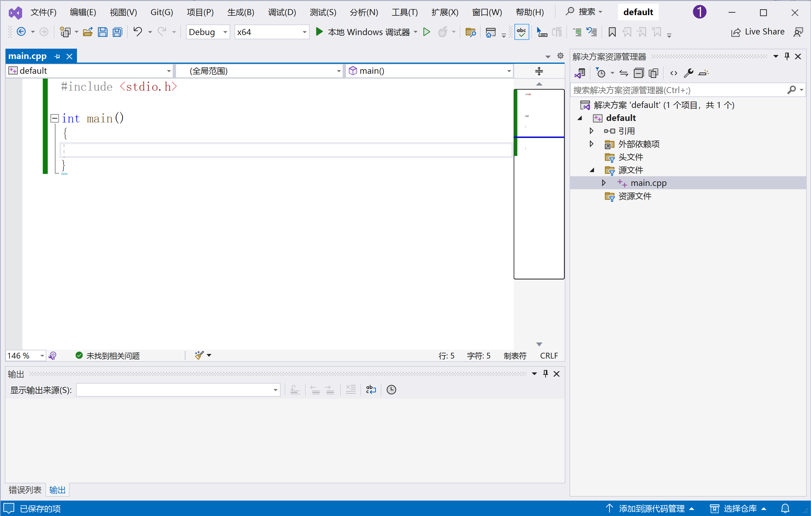
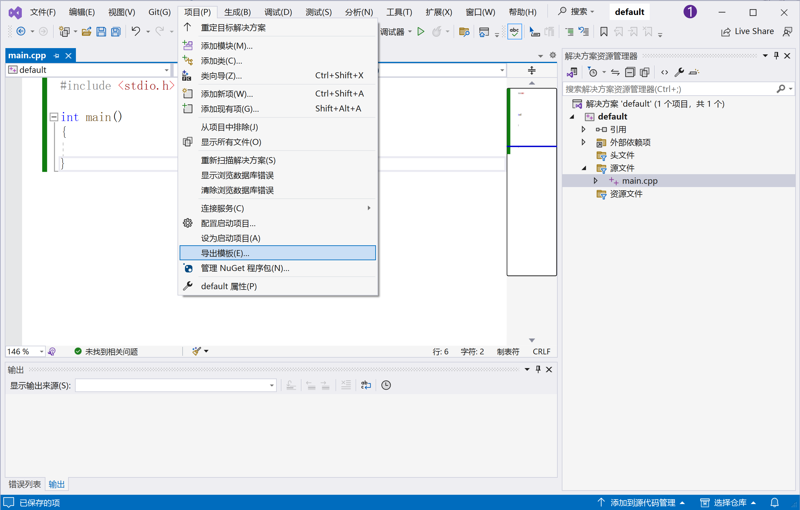
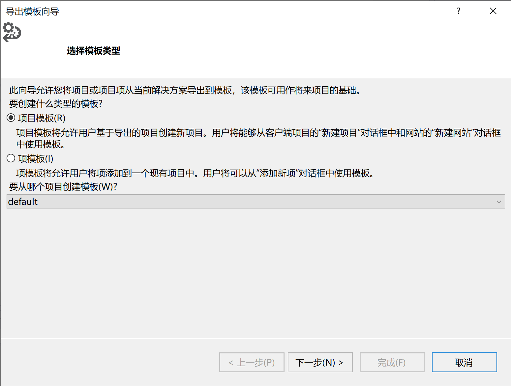
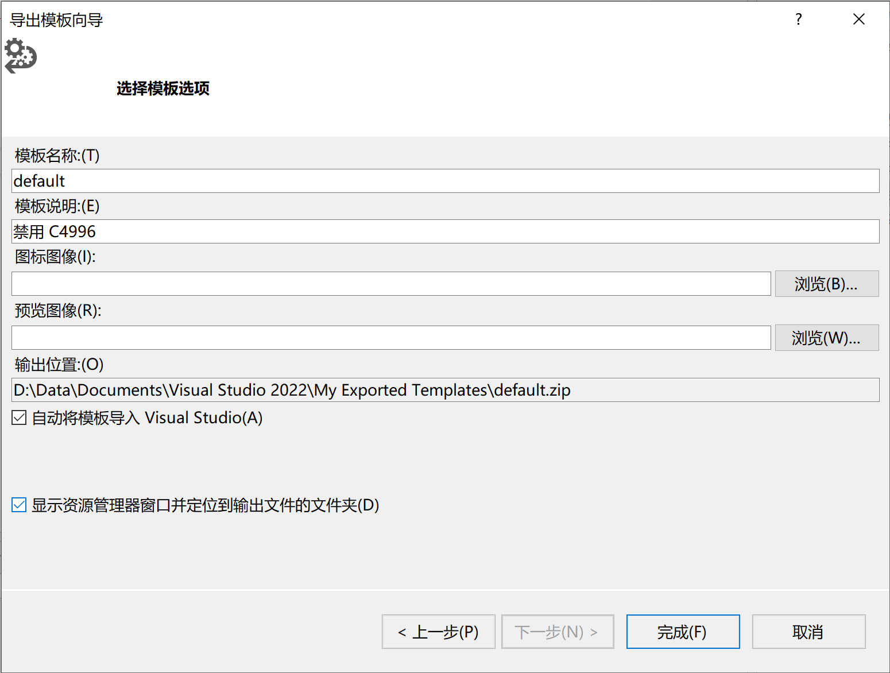
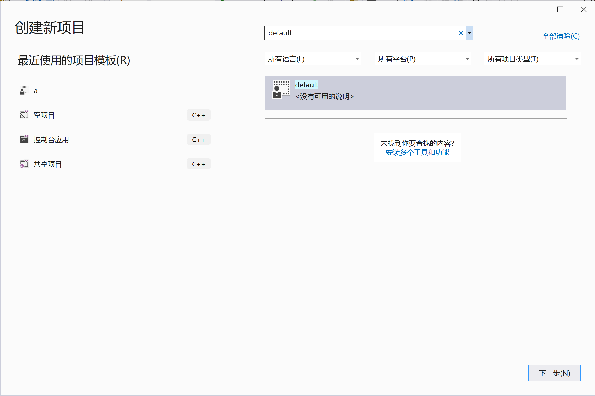

# Visual Studio 相关

以下是一些 Visual Studio 相关的常见问题。

## 禁用 Visual Studio 关于 scanf 的 C4996 错误

在使用 Visual Studio 编写 C 程序时，如果你在代码中使用了 scanf 函数，将会发生报错。尽管 Visual Studio 认为 scanf 不安全，并要求你使用 scanf_s，现阶段我们还不需要考虑安全性的问题，并且，由于 OJ 上并不支持 scanf_s 函数，带有 scanf_s 的代码提交到 OJ 上会报错。总之，将其禁用可以解决这些不一致带来的问题。

可以看到，Visual Studio 对下面的代码报错了。

``` cpp
#include <stdio.h>

int main()
{
	int a, b;
	scanf("%d%d", &a, &b);
	printf("%d", a + b);
}
```



在上方的 `项目` 选项单中的下拉菜单点击 `..属性`。在弹出的窗口中找到 `配置属性 > C/C++ > 高级` 在 `禁用特定警告` 设置里添加 `4996`。





修改后，我们的程序可以正常编译运行了。



但是这样的方法治标不治本，当你新建新的项目时，又需要重设一遍。为此，我们需要使用模板功能。首先，新建一个项目，项目中新建一个代码，由于其会作为模板使用，故可用如下的模板代码代替。接下来，按照刚才的方法禁用 C4996 错误。

``` cpp
#include <stdio.h>

int main()
{

}
```



然后点击 `项目 > 导出模板...`，点击下一步。填写你的模板名称，如 `default`，然后继续。模板即创建完成。







接下来，新建一个项目，搜索我们刚刚填写的模板名字，然后基于该模板新建项目，这样，新建的项目就不再出现 C4996 错误。

