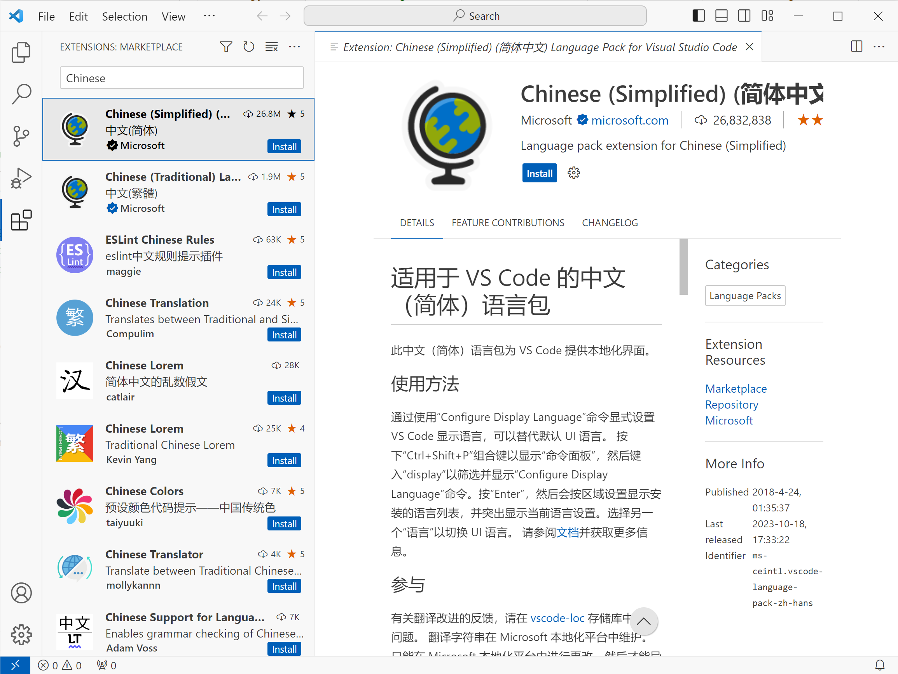
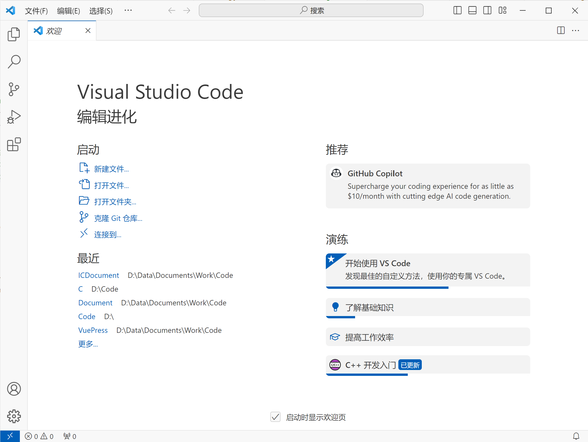
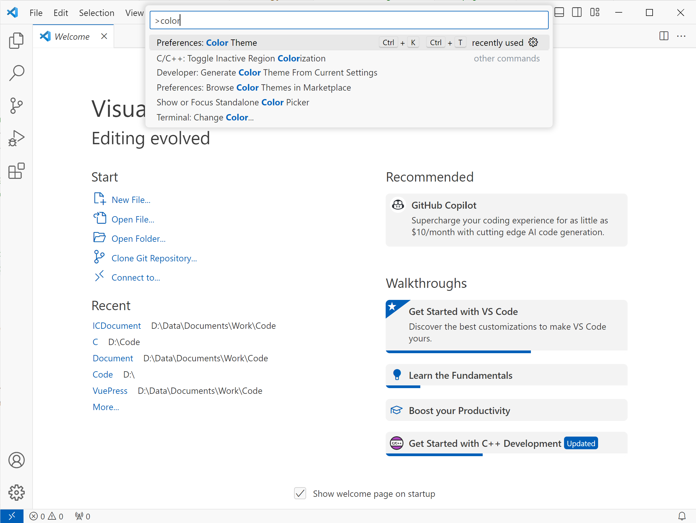
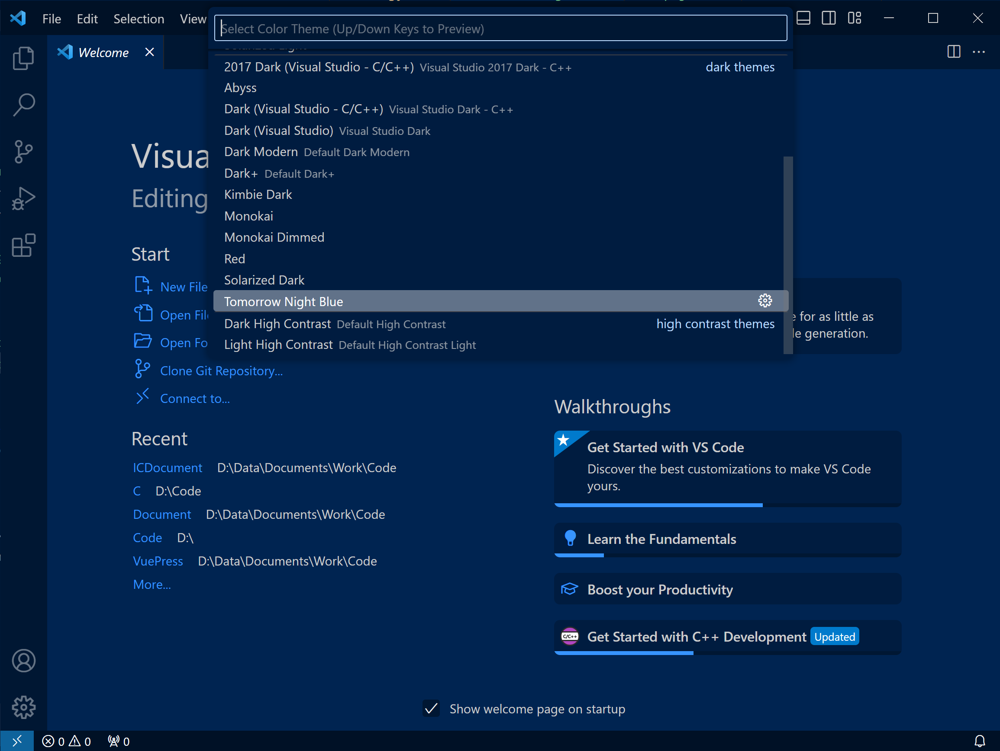
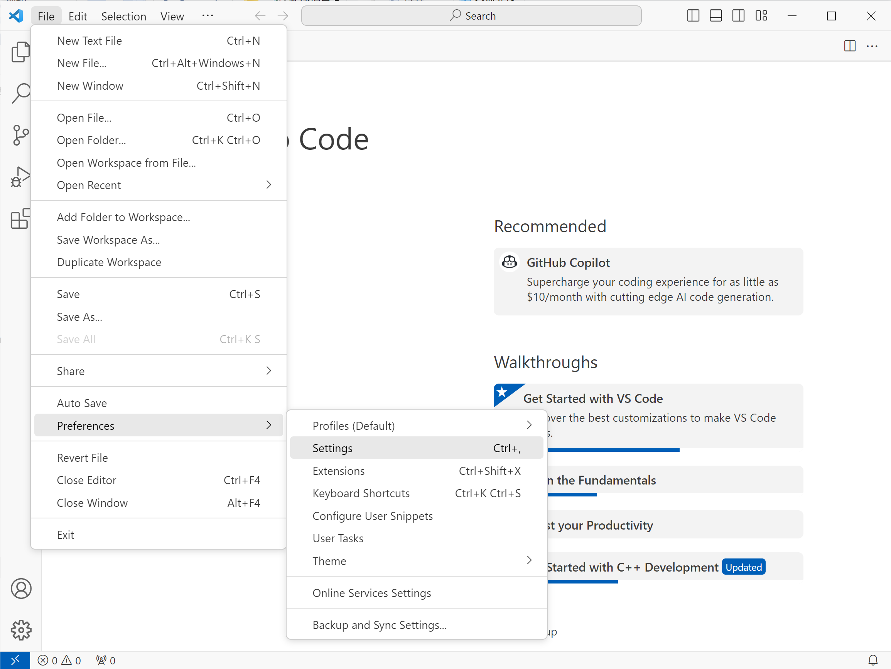
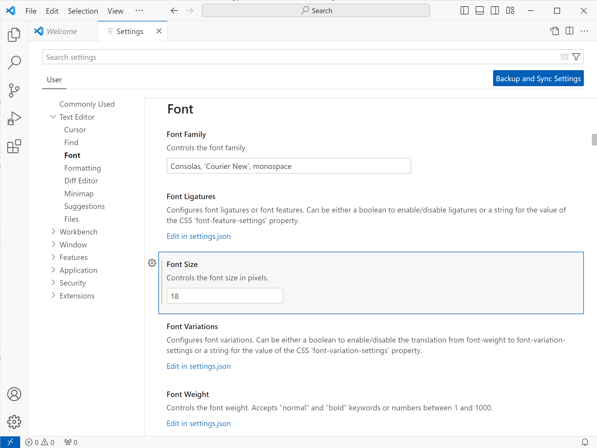
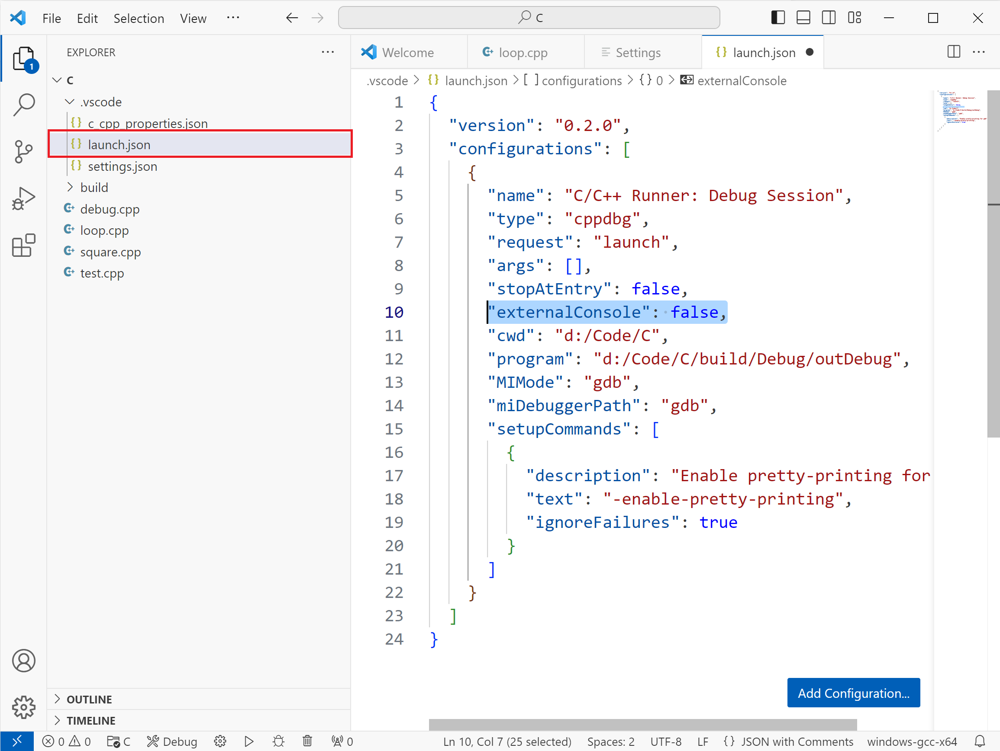
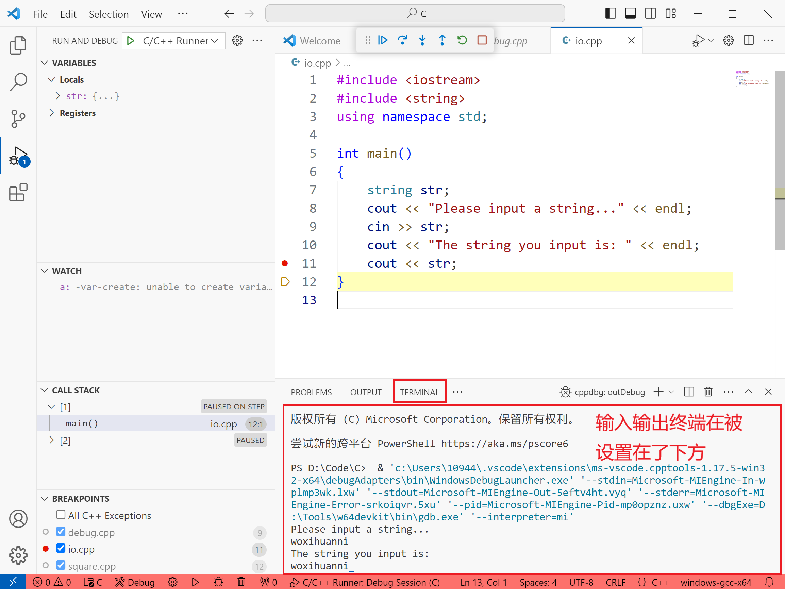
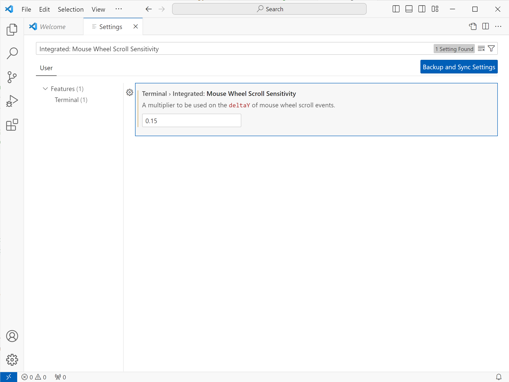

# VSCode 的配置

## 使用汉化扩展

::: tip 提示
我很建议你使用英文的操作界面，但如果你实在是一个英文苦手，那就没办法了。
:::

在 VScode 的扩展中搜索 `Chinese`，安装 `Chinese (Simplified) (简体中文) Language Pack for Visual Studio Code ` 扩展。安装完成后按照提示重启 VSCode。可以看到 VSCode 界面已被汉化。

::: warning 注意
本扩展只能汉化 VSCode 的操作界面。函数声明，错误信息，编译器的终端输出等这些由外部提供的消息仍然无法汉化！
:::

## 切换语言

如果你想切换 VSCode 界面的语言，可以按 `Ctrl+Alt+P` 找到 `Configure Display Language` 并点击，即可切换成你想要的语言。

## 切换主题

如果你不喜欢 VSCode 的默认主题，可以按 `Ctrl+Alt+P` 找到 `Preferences: Color Theme`，然后即可切换成你喜欢的颜色主题。

## 调整字体和字体大小

点击左上角的 `File`，在下拉菜单中选择 `Preferences（首选项） > Settings（设置）`，在弹出的 `Settings` 标签页中找到 `Font（字体）` 相关设置，`Font Size（字体大小）` 设置可以调整字体大小。`Font Family` 则可以更换字体。一般而言，默认的 `Consolas` 字体就很适合编写代码了，没有再进行更换的必要了。

## 在调试时使用内置集成终端

默认情况下，VSCode 调试时，程序终端会弹出新的窗口，如果你觉得在 VSCode 窗口和程序的输入输出终端窗口来回切换比较麻烦，可以调整配置将输入输出终端整合到集成终端上。打开工作区下的 `.vscode/launch.json` 文件，将 `externalConsole` 的值修改为 `false`。再次运行调试，可以看到，输入输出终端现在可以直接在 VSCode 的集成终端上使用了。

::: warning 注意
你必须在打开一个工作区（打开文件夹），并且编译运行了一次 C/C++ 代码后，才会生成 `launch.json` 文件！新建的空白工作区或者在未打开工作区的情况下是没有 `launch.json` 文件的！
:::

## 更改终端的滚动速度

使用鼠标滚轮在终端上滚动时，你可能会感觉滚动速度过快。你可以在设置中修改滚动速度。首先打开设置，点击左上角的 `File`，在下拉菜单中选择 `Preferences（首选项） > Settings（设置）`，找到 `Integrated: Mouse Wheel Scroll Sensitivity` 选项（善用搜索功能~），可以看到默认值是 `1`，我们将其修改为 `0.15`（或是你需要的值）。随意运行一个程序，在终端上使用鼠标滚轮滚动，你应该能感受到速度发生了变化。

## 更多设置

除此之外，VSCode 含有许多丰富的设置，在此我不一一介绍了。你可以查看 [VSCode 的官方文档](https://code.visualstudio.com/docs/getstarted/settings)或者在网上搜索如何更改相关配置。