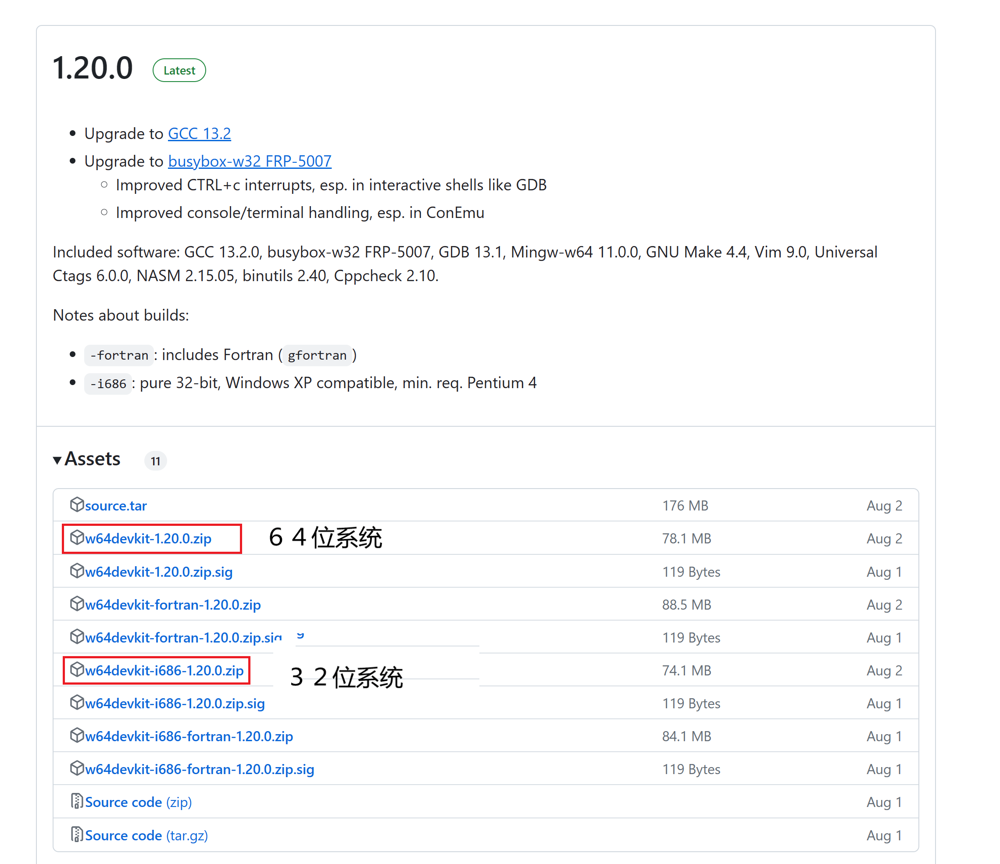
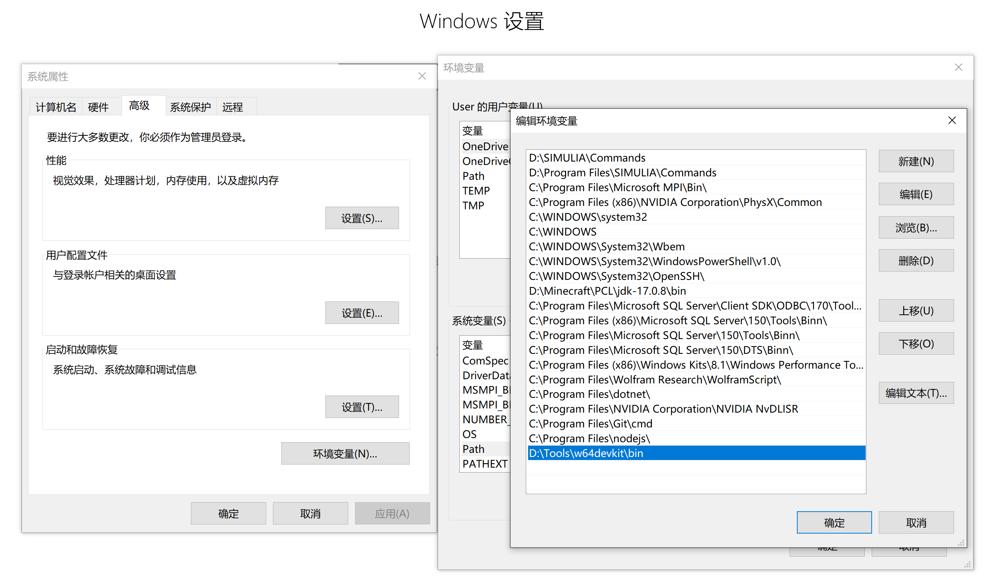
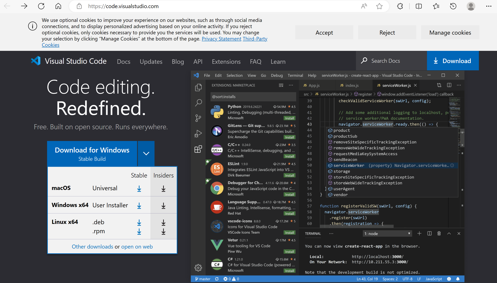
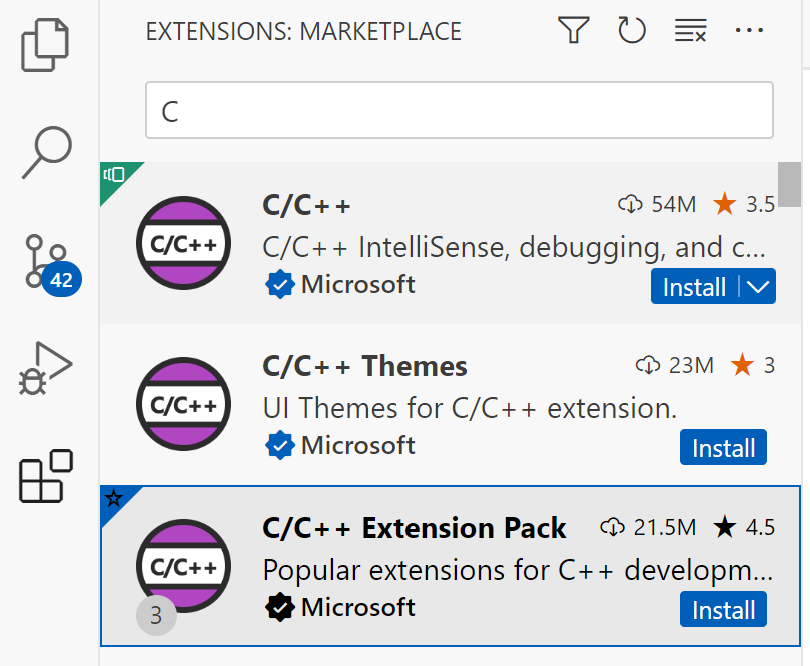

# 配置 VSCode C/C++ 开发环境

> VSCode 全称 Visual Studio Code，是微软出的一款轻量级代码编辑器，免费、开源而且功能强大。它支持几乎所有主流的程序语言的语法高亮、智能代码补全、自定义热键、括号匹配、代码片段、代码对比 Diff、GIT 等特性，支持插件扩展，并针对网页开发和云端应用开发做了优化。软件跨平台支持 Win、Mac 以及 Linux。

相比于同公司的 Visual Studio，VS Code 更加轻量和便携，更适于我们现阶段的学习和使用。此外，随着你学习的深入和进行，你很可能会继续学习接触到其他语言，而 VSCode 对各类编程语言的支持性，使其成为一个十分方便的开发软件。VSCode 的高度可自定义的配置还能够满足你个性化的需求。

## 安装 C/C++ 编译器

严格来说，VSCode 不是集成开发环境，其只是一款文本编辑器。因此，不具备 C/C++ 语言的编译和调试功能，因此我们需要对 VSCode 进行相应的配置，使其能用于 C/C++ 语言的程序开发。

首先需要安装 C/C++ 编译器。目前的 C/C++ 编译器有几个主要流派，如果你对编译器不了解，可以按照本文档的介绍来安装。

根据你的操作系统参阅：
- [Windows 系统](./VSCode.md#windows-系统)

### Windows 系统

在 Github 上下载 MingW 编译器，点击[此处](https://github.com/skeeto/w64devkit/releases)以打开链接，在 Assests 下选择适用于你系统位数的压缩包，如 64 位系统选择 `w64devkit-1.20.0.zip`，32 位系统选择 `w64devkit-i686-1.20.0.zip`。如果你不知道你的操作系统的位数，请参阅[如何查看我的操作系统的位数](\404)。

下载完毕后，解压的合适的目录，注意，编译器的文件路径中不要含有中文字符！如我的文件目录如下。

接下来，将编译器添加到环境变量中。首先，复制 `w64devkit` 文件夹下 `bin` 文件夹的路径。我的路径如下。

按 `WIN+I` 打开设置界面，搜索 `环境变量`，选中 `编辑系统环境变量`，在弹出的窗口中选中 `环境变量` 按钮，在 `系统变量` 中找到并选中 `Path` 变量，点击 `编辑` 按钮，在弹出的窗口中点击 `新建` 按钮，将编译器的路径复制粘贴进去，然后点击 `确定` 完成配置。

### Linux 系统

### Mac 系统

## 安装 VSCode 和相应插件

进入 [VSCode 官网](https://code.visualstudio.com/)，下载并安装适用于你的操作系统的版本。

完成安装后打开 VSCode，在左侧边栏中选中 `Extensions` 选项单，然后在子窗口中搜索 `C`，找到 `C/C++ Extension Pack` 然后点击 `Install` 安装。同样在继续安装扩展 `C/C++ Runner`。

安装完成！编写一个 `Hello World` 程序来体验一下吧！

**参阅：**
- [使用 VSCode 编写 C/C++ 程序](./VSCodeUsage.md)