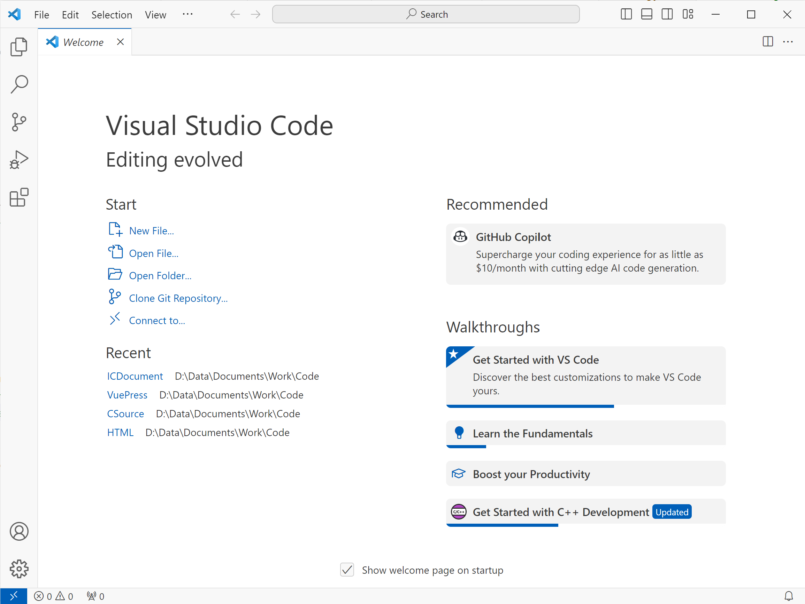
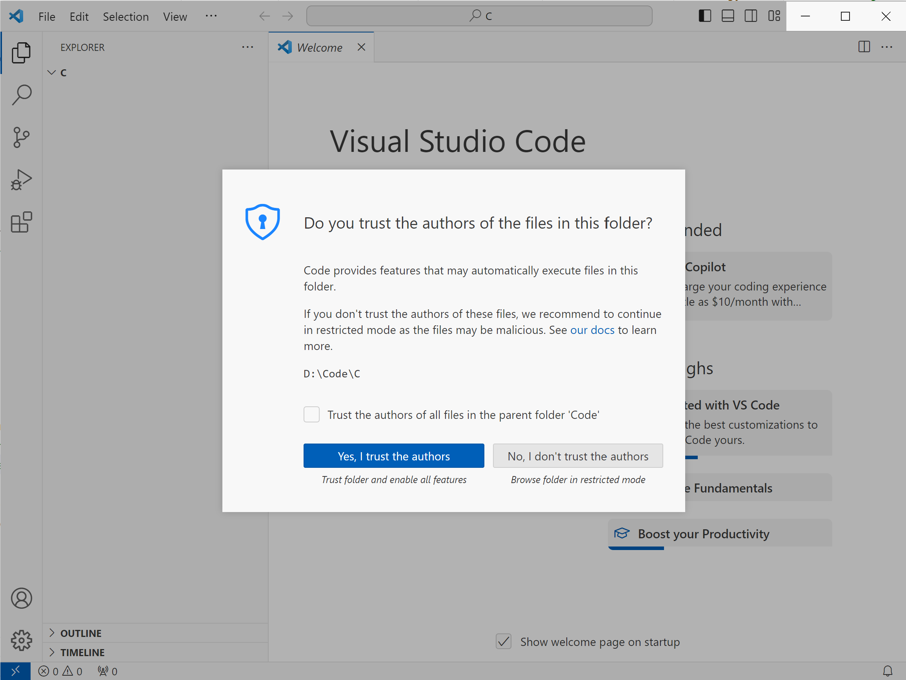
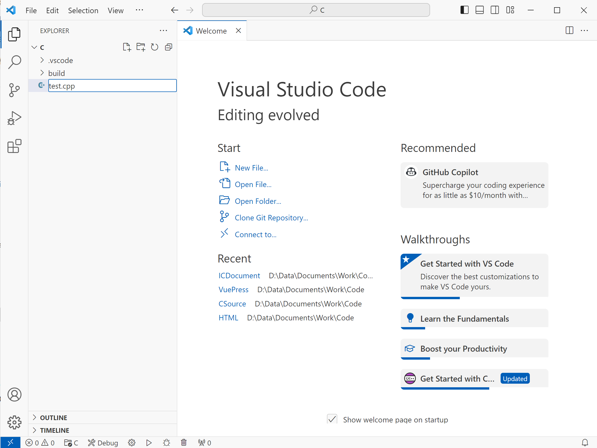
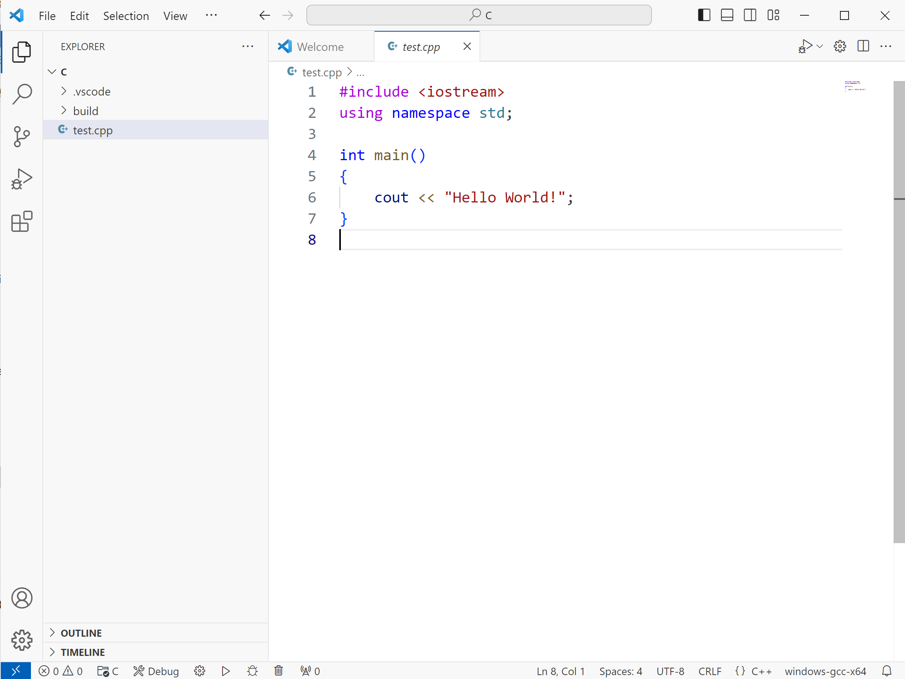
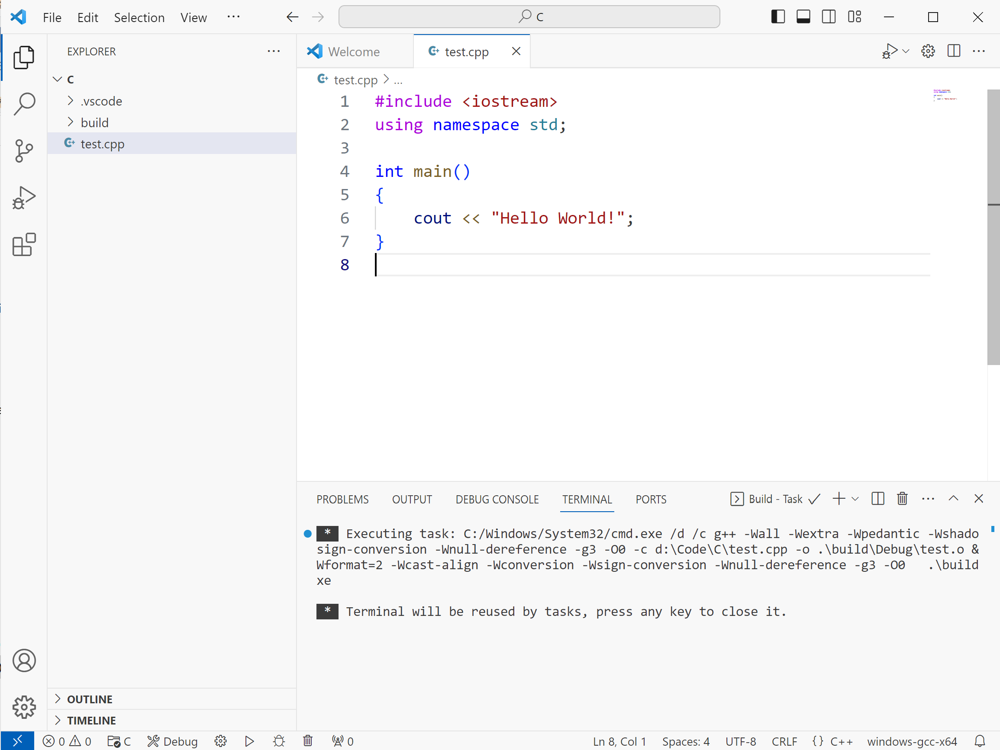
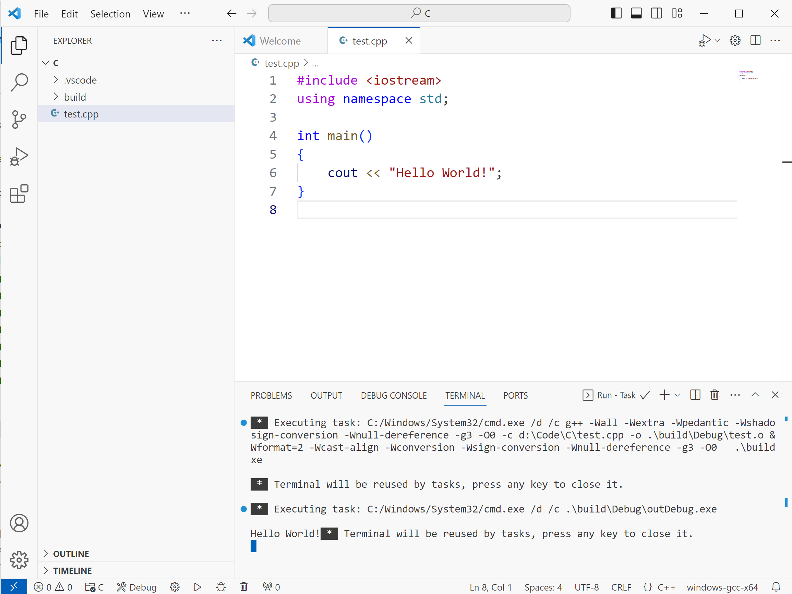

# 使用 VSCode 编写 C/C++ 程序

本篇文章将介绍如何使用 VSCode 编写 C/C++ 程序。首先打开 VSCode，可以看到如下的界面。

你可能注意到了你的 VScode 的界面和我的可能稍微不太一样，就比如颜色。这是因为我使用了非默认的主题，便于教学和演示。如果你不喜欢默认主题，你可以参阅[如何更换 VSCode 主题](/)。

接下来点击欢迎界面中的 `Open Folder` 打开一个新的文件夹。以后，我们所编写的代码都会放在这个文件夹中。注意，你的文件夹的路径不能含有中文字符！在此，我的选择的路径是 `D:\Code\C`。某些时候，你的 VSCode 可能不显示欢迎界面，这时，点击左上方的 `File` 菜单，在下拉菜单中选择 `Open Folder..` 也可以打开一个新的文件夹。

打开新文件夹后，VSCode 会弹出一个警告，点击 `Yes, I Trust the authors` 信任文件夹。

在左边的 `Explorer` 子窗口中点击 `New file` 按钮，新建一个文件。注意，文件后缀名应为 `.cpp` 或 `.c` 以确保 VSCode 能将其正确识别为 C++ 或 C 的源代码。

接下来，在主窗口中编写代码。

编写完成后，按下 `Ctrl+Alt+B` 进行编译，此时，VSCode 下方会弹出内置终端，用来显示终端消息。看到下面的消息后，表明编译已经完成。

::: warning
如果你没有安装扩展 `C/C++ Runner`，快捷键 `Ctrl+Alt+B` 将不会起作用！
:::

接下来，按下 `Ctrl+Alt+R` 运行程序。可以看到下方终端输出 `Hello World!`，再次按下任意键即可关闭终端。

**参阅：**

- VSCode 更多的功能和用法